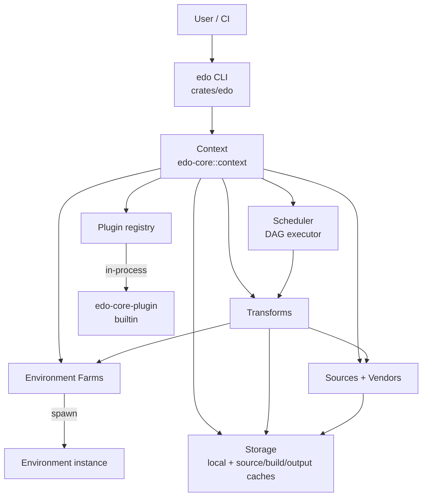
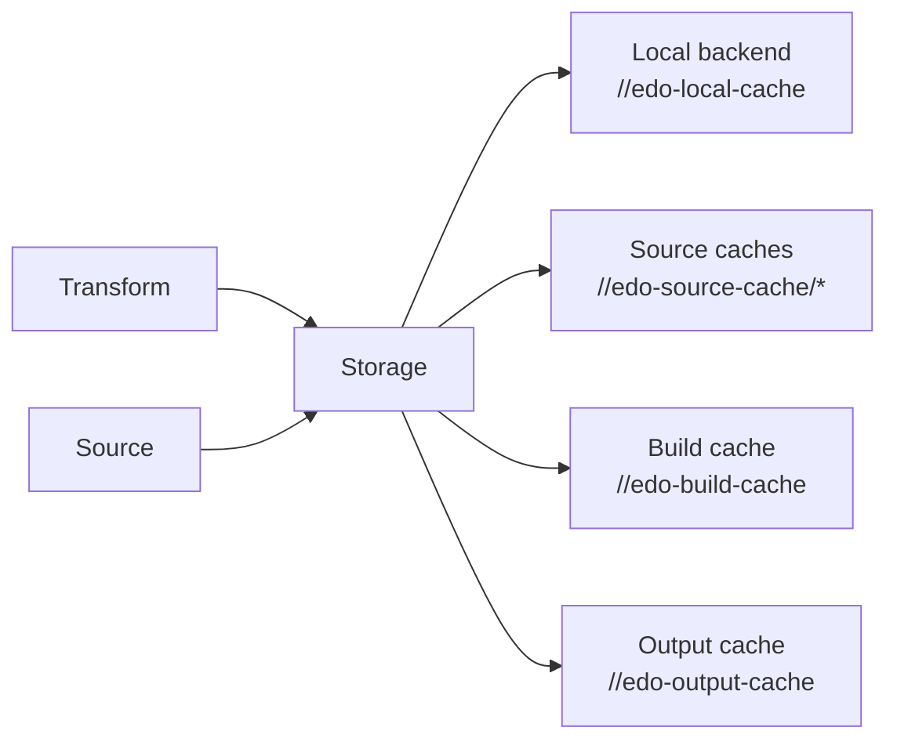

# Architecture

## High-Level Architecture

Edo is built around four pluggable abstractions — **Storage**, **Source**, **Environment**, **Transform** — orchestrated by a **Context** and executed by a **Scheduler**. Extensibility is delivered through a **Plugin system** that exposes each abstraction through a well-defined plugin boundary.

## Core Abstractions (traits in `edo-core`)

All four abstractions use the `arc_handle` crate macro, which generates a newtype handle around `Arc<dyn Trait>` so the same handle type is used regardless of the underlying plugin implementation.

| Trait         | Location                           | Role                                                                          |
| ------------- | ---------------------------------- | ----------------------------------------------------------------------------- |
| `Backend`     | `edo-core/src/storage/backend.rs`  | Raw artifact store (list/has/open/save/del/layer I/O).                        |
| `Source`      | `edo-core/src/source/mod.rs`       | Fetch external code/artifacts; stage into an environment.                     |
| `Vendor`      | `edo-core/src/source/vendor.rs`    | Resolve named+versioned dependencies into concrete nodes.                     |
| `Environment` | `edo-core/src/environment/mod.rs`  | Execute commands in an isolated build env.                                    |
| `Farm`        | `edo-core/src/environment/farm.rs` | Factory for `Environment` instances (setup + create).                         |
| `Transform`   | `edo-core/src/transform/mod.rs`    | Produce an output artifact from inputs; defines DAG deps.                     |
| `Plugin`      | `edo-core/src/plugin/mod.rs`       | Creates `Backend`/`Farm`/`Source`/`Transform`/`Vendor` from an `Addr`+`Node`. |

## Context

`Context` (`edo-core/src/context/mod.rs`) is the central coordinator for a build session. It holds:

- Project path & working dir (`.edo/`)
- `Config` (loaded from `edo.toml` via `Schema::V1`)
- `Storage` (composite of local + named source caches + optional build/output caches)
- `Scheduler`
- Registered plugins, farms, sources, transforms, vendors (each keyed by `Addr`)
- `Lock` (loaded from / written to `edo.lock.json`)
- `LogManager` driving per-task log files

`Context::init` constructs the session; `create_context` in the CLI then registers the builtin plugin and a default `//default` local farm before calling `Context::load_project(locked)`.

## Storage Layering

Storage exposes `safe_open` / `safe_read` / `fetch_source` etc. and synchronizes remote-cached artifacts into the local backend before use. The only builtin non-local backend is `s3`.

## Plugin Boundary

Plugins implement the `Plugin` trait (via `PluginImpl`) and are registered in `Context`. The builtin `edo-core-plugin` is an in-process implementation that dispatches by `kind`. The adapter layer in `crates/edo-core/src/plugin/impl_/` (one file per resource: `backend`, `environment`, `farm`, `handle`, `source`, `transform`, `vendor`) bridges plugin implementations to the native `edo-core` traits.

The guest side is supported by `crates/edo-plugin-sdk/` which provides a `Stub` with "not implemented" defaults so plugin authors can implement only the resources they need.

## Scheduling

`Scheduler::run(ctx, addr)` (`edo-core/src/scheduler/mod.rs`) builds a dependency `Graph` from the target transform, fetches sources, then executes the DAG with `N` worker tasks (default 8, overridable via `[scheduler] workers = …` in config). See `workflows.md` for the full run sequence.

## Addressing (`Addr`)

Everything registered in a `Context` is keyed by a hierarchical address, parsed via `Addr::parse`. Conventional prefixes observed in code:

- `//<project>/<name>` — user-defined items in the current project (e.g. `//hello_rust/build`).
- `//default` — default local environment farm.
- `//edo-local-cache`, `//edo-source-cache/<name>`, `//edo-build-cache`, `//edo-output-cache` — storage backend slots.
- `edo` (no leading `//`) — the builtin core plugin registration address.

## Error Strategy

- Every subsystem defines a typed `*Error` enum with `snafu`.
- `main.rs` aggregates them via `#[snafu(transparent)]` variants and uses `#[snafu::report]` to print.
- Plugin errors are surfaced through guest-owned `error` resources with `to-string`.

## Known Design / Docs Divergences

- `README.md` and `docs/design.md` describe a **Starlark** configuration language, but the implementation uses **TOML** (`schema-version = "1"`) — see `crates/edo-core/src/context/schema.rs` and every `examples/*/edo.toml`. No `starlark` crate is in `Cargo.toml`.
- `docs/design.md` diagrams a "Build Engine" that does not exist as a named type; its responsibilities are spread across `Context` + `Scheduler`.
