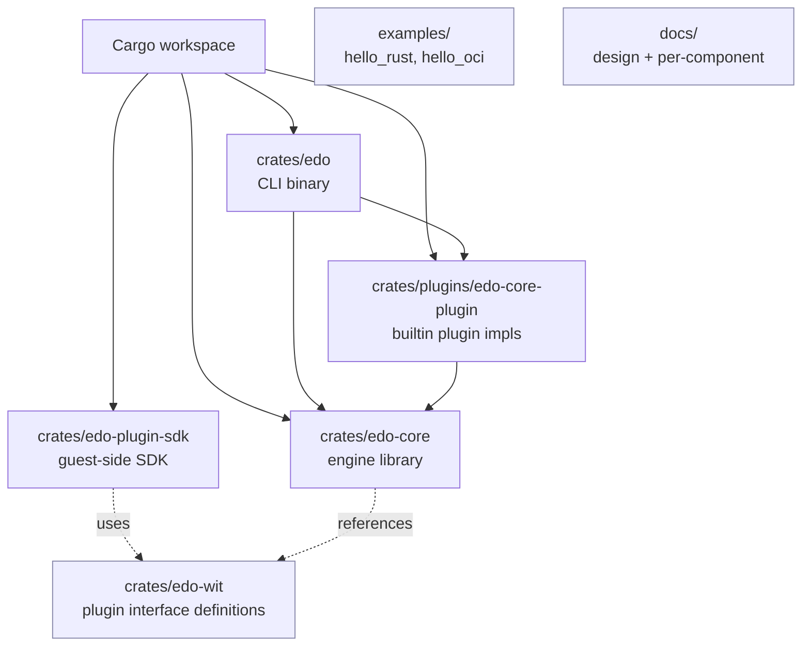

# Codebase Info: Edo

## Project Identity

- **Name**: Edo
- **Purpose**: Next-generation build tool focused on flexible build environments and reproducible builds; positioned as an alternative to Bazel / Buck2 / BuildStream.
- **Owner**: awslabs (`https://github.com/awslabs/edo`)
- **License**: Dual `Apache-2.0 OR MIT`
- **Status**: Pre-1.0, active development.

## Languages & Technology Stack

- **Primary language**: Rust (edition 2024, requires Rust ≥ 1.86)
- **Runtime concurrency**: `tokio` (full feature set), `parking_lot`, `dashmap`
- **Plugin system**: plugin host for extensibility
- **Project config format**: TOML (`edo.toml`, `schema-version = "1"`)
- **Lock format**: JSON (`edo.lock.json`)
- **OCI interop**: `ocilot` (git dep), `astral-tokio-tar`, `async-compression`
- **Cloud SDKs**: `aws-config`, `aws-sdk-s3`, `aws-sdk-ecr`, `aws-sdk-ecrpublic`
- **Resolver**: `resolvo` for dependency/version resolution
- **CLI**: `clap` (derive)
- **Errors**: `snafu`
- **Serialization**: `serde`, `serde_json`, `toml`, `handlebars` (templating)
- **Hashing**: `blake3`, `sha2`, `merkle_hash`
- **Supply-chain policy**: `cargo-deny` (`deny.toml` present)

## Workspace Layout

Notes:

- `crates/edo-wit` is not a Cargo crate (no `Cargo.toml`); it contains the plugin interface definitions consumed by both the host and the SDK.
- `default-members = ["crates/edo"]` — plain `cargo build` builds the CLI only.
- `examples/` is excluded from the workspace.

## Runtime Directory Conventions

- `.edo/` inside a project: edo's working directory (local cache, scheduler state, plugin fetch). Default subdir name is `DEFAULT_PATH = ".edo"` in `edo-core/src/context/mod.rs`. Ignored via `.gitignore` (`**/.edo`).
- `edo.toml`: per-project manifest (required at project root or passed via `-c`).
- `edo.lock.json`: resolver output committed next to `edo.toml` (ignored via `**.lock.json` in `.gitignore` — note this pattern matches the example file too).

## Key Source Directories

- `crates/edo/src/cmd/` — CLI subcommands (one file per command).
- `crates/edo-core/src/context/` — `Context`, addressing (`Addr`), config, `Node` data tree, TOML schema, lock file, logging, per-project `Project` loader.
- `crates/edo-core/src/storage/` — artifact model, `Backend` trait, `LocalBackend`, OCI-style layers, content catalog.
- `crates/edo-core/src/source/` — `Source` and `Vendor` traits, requirement/version resolver (resolvo).
- `crates/edo-core/src/environment/` — `Environment` and `Farm` traits + deferred `Command` builder.
- `crates/edo-core/src/transform/` — `Transform` trait and `TransformStatus`.
- `crates/edo-core/src/scheduler/` — DAG-based parallel execution engine.
- `crates/edo-core/src/plugin/` — plugin host, bindings bridge, per-resource adapters in `impl_/`.
- `crates/edo-core/src/util/` — shared async `Reader`/`Writer`, fs/command/sync helpers.
- `crates/plugins/edo-core-plugin/src/` — in-process builtin plugin that implements `PluginImpl` directly and supplies: `s3` storage; `local`/`container` farms; `git`/`local`/`image`/`remote`/`vendor` sources; `compose`/`import`/`script` transforms; `image` vendor.

## Supported / Unsupported Kinds (from `core_plugin.supports`)

| Component      | Supported `kind` values                     |
| -------------- | ------------------------------------------- |
| StorageBackend | `s3`                                        |
| Environment    | `local`, `container`                        |
| Source         | `git`, `local`, `image`, `remote`, `vendor` |
| Transform      | `compose`, `import`, `script`               |
| Vendor         | `image`                                     |

Anything outside this set must be supplied by a plugin.

## Entry Points

- **Binary**: `crates/edo/src/main.rs` — `#[tokio::main] async fn main()`. Subcommands: `Checkout`, `Run`, `Prune`, `Update`, `List`.
- **Context bootstrap**: `crates/edo/src/cmd/mod.rs::create_context` registers the builtin core plugin at address `edo` and a default local farm at `//default` before calling `Context::load_project`.
- **Builtin plugin factory**: `edo_core_plugin::core_plugin()` → `Plugin::new(CorePlugin)`.
