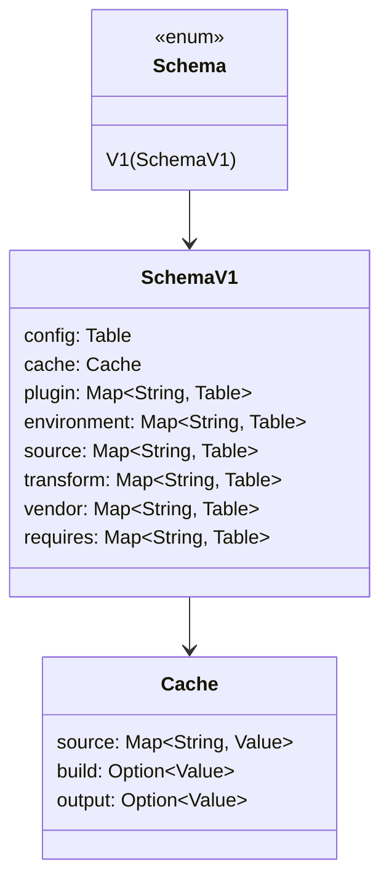
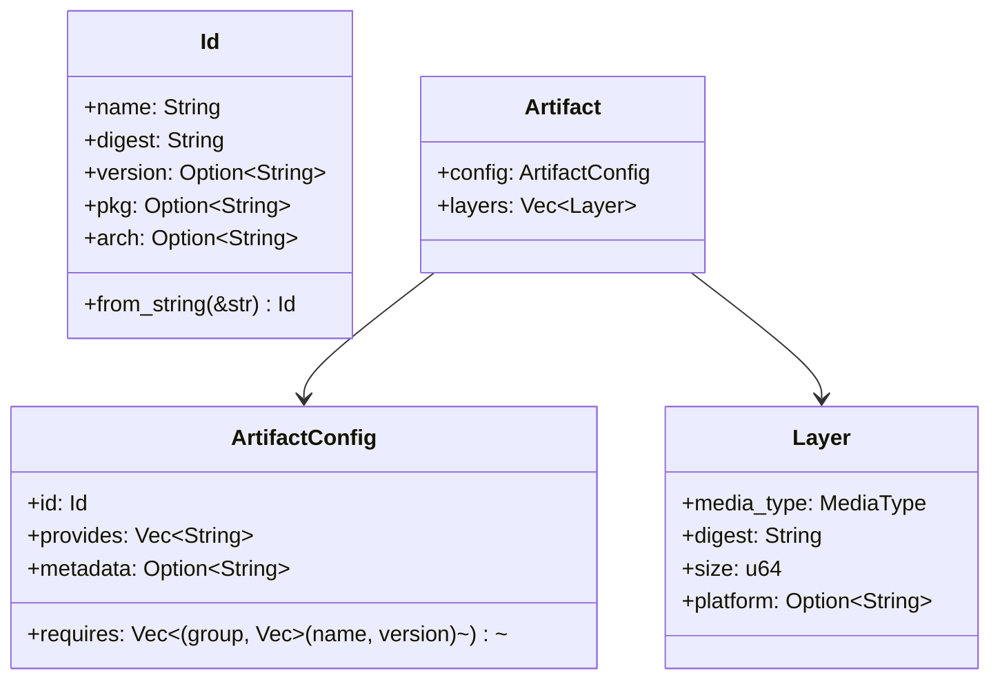

# Data Models

## Manifest Schema (TOML)

File: `edo.toml` at project root. Top-level discriminator `schema-version = "1"` → `Schema::V1(SchemaV1)` in `crates/edo-core/src/context/schema.rs`.



Every table entry is translated into a `Node` definition via `toml_def_item` (see `context/schema.rs`), preserving `id` / `kind` / `name` plus an arbitrary key-value `table`.

## `Node` — Generic Data Tree

Defined in `crates/edo-core/src/context/node.rs` (and mirrored as a resource in `host.wit`).

Carries either a raw value or a "definition" (`record definition { id, kind, name, table }`). Accessors:

- `as_bool`, `as_int`, `as_float`, `as_string`, `as_version`, `as_require`
- `as_list`, `as_table`
- `get_id`, `get_kind`, `get_name`, `get_table`, `validate_keys`

`FromNode` / `FromNodeNoContext` traits convert `Node` + `Addr` (+ `Context`) into strongly-typed plugin configs. The `non_configurable!` macro provides a default blank impl.

## Addresses

```rust
pub struct Addr { /* hierarchical path segments */ }
```

- `Addr::parse(&str) -> Result<Addr>` with leading `//` or bare segment form.
- `Addr` is the key type for every per-project registry on `Context`.

## Artifacts & Layers (OCI-aligned)

Lives in `crates/edo-core/src/storage/`.



### `MediaType` + `Compression`

`crates/edo-core/src/storage/artifact.rs` exposes:

- `MediaType::Tar(Compression)` (handled by `edo checkout`)
- Other OCI-style media types for configs / JSON / opaque blobs.
- `Compression::{None, Gzip, Bzip2, Lz, Xz, Zstd}` — `checkout.rs` decoders select based on this.

### Artifact ID

Content-addressed; derived from hashing transform inputs (`get_unique_id`) or source contents. Enables deterministic cache hits.

## Storage Composite

`Storage` holds several `Backend`s in distinct roles (`storage/mod.rs::Inner`):

```
local:  Backend              // //edo-local-cache, required
source: IndexMap<name, Backend>  // //edo-source-cache/<name>, ordered priority
build:  Option<Backend>      // //edo-build-cache
output: Option<Backend>      // //edo-output-cache, publish-only
```

## Transform Status

```rust
pub enum TransformStatus {
    Success(Artifact),
    Retryable(Option<PathBuf>, TransformError),
    Failed(Option<PathBuf>, TransformError),
}
```

Crosses the wasm boundary as `variant transform-status` (see `host.wit`). `Option<PathBuf>` is an optional path hint for the failed working directory.

## Lock File

File: `edo.lock.json` (see `.gitignore`: `**.lock.json`). Defined in `crates/edo-core/src/context/lock.rs`:

```rust
pub struct Lock {
    digest: String,                       // hash of the manifest inputs
    #[serde(rename = "refs")]
    content: BTreeMap<Addr, Node>,        // resolved dependency nodes
}
```

Written by `edo update`; consumed in "locked" mode by every other subcommand (they call `create_context(..., locked = true)`).

## Log Model

- `LogVerbosity::{Info, Debug, Trace}` set on CLI by `--debug` / `--trace`.
- `LogManager` wires `tracing-subscriber` + `tracing-indicatif` for structured + progress output.
- Per-task logs are files managed by `Log` handles and exposed to plugins via `host.log.write`.

## Error Hierarchy

All errors are `snafu::Snafu` enums. Root aggregation in `crates/edo/src/main.rs::error::Error`:

```
Error
├── Io(std::io::Error)
├── Context  (edo_core::context::ContextError)
├── Storage  (edo_core::storage::StorageError)
├── Environment (edo_core::environment::EnvironmentError)
├── Source   (edo_core::source::SourceError)
├── Transform(edo_core::transform::TransformError)
├── Plugin   (edo_core::plugin::error::PluginError)
└── Core     (edo_core_plugin::error::Error)
```

`TransformError` itself `#[snafu(transparent)]`-wraps Context/Environment/Source/Storage errors, so most call sites can bubble with `?`.
