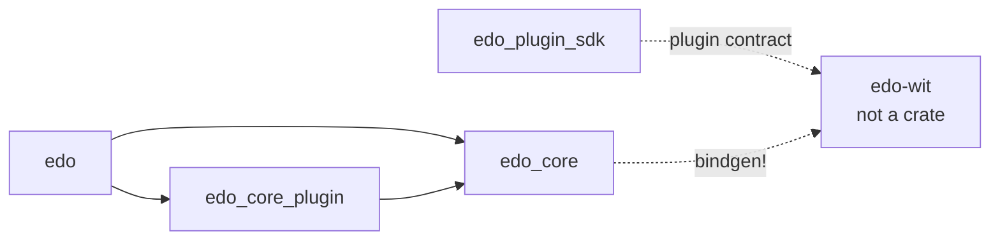

# Dependencies

All versions live in `[workspace.dependencies]` in the root `Cargo.toml`; individual crates pick them via `{ workspace = true }`.

## Runtime & Async Core

| Crate                     | Role in edo                                                             |
| ------------------------- | ----------------------------------------------------------------------- |
| `tokio`                   | Async runtime (feature `full`, multi-thread, `parking_lot`).            |
| `async-trait`             | Used on every `Source` / `Transform` / `Environment` / `Plugin` trait.  |
| `async-recursion`         | Graph walking in scheduler.                                             |
| `futures`, `futures-util` | Combinators.                                                            |
| `parking_lot`             | Fast locks (also backs tokio sync). `send_guard` feature enabled.       |
| `dashmap`                 | Per-context concurrent maps (`ArcMap<K, V>` alias in `context/mod.rs`). |
| `arc-handle`              | Newtype-around-`Arc<dyn Trait>` handle macro for core traits.           |

## CLI, Config, Errors, Logging

| Crate                 | Role                                                             |
| --------------------- | ---------------------------------------------------------------- |
| `clap` (derive)       | CLI parsing.                                                     |
| `dialoguer`           | Interactive prompts (shell-on-failure flow).                     |
| `snafu`               | Every error enum in the workspace. `#[snafu::report]` on `main`. |
| `tracing`             | Structured logging; `#[macro_use] extern crate tracing` in libs. |
| `tracing-subscriber`  | Env filter, formatting.                                          |
| `tracing-indicatif`   | Progress bars integrated with tracing spans.                     |
| `indicatif`           | Progress bar primitives.                                         |
| `owo-colors`          | Colored CLI output.                                              |
| `serde`, `serde_json` | Serialization (lock file, metadata, node tree).                  |
| `toml`                | Parse `edo.toml`.                                                |
| `handlebars`          | Template `{{install-root}}` etc. in script commands.             |
| `chrono`              | Timestamps (serde feature).                                      |
| `home`                | User home dir discovery.                                         |
| `cfg-if`              | Platform branching.                                              |
| `names`               | Human-readable ID generation.                                    |
| `uuid`                | v7 IDs (in core plugin).                                         |
| `semver`              | Version parsing (source resolver).                               |
| `regex`               | Parsing helpers.                                                 |

## Plugin System

| Crate           | Where | Role                                                                   |
| --------------- | ----- | ---------------------------------------------------------------------- |
| `wasmtime` 44   | host  | Plugin runtime engine.                                                 |
| `wasmtime-wasi` | host  | WASI support for guest plugins.                                        |
| `wit-bindgen`   | guest | Used by `edo-plugin-sdk` to generate plugin bindings.                  |

## Storage / Artifacts / I/O

| Crate               | Role                                                            |
| ------------------- | --------------------------------------------------------------- |
| `ocilot` (git dep)  | OCI image / registry operations. Sourced from `awslabs/ocilot`. |
| `astral-tokio-tar`  | Tar packing/unpacking (imported as `tokio_tar`).                |
| `async-compression` | Zstd / Gzip / Bzip2 / Lzma / Xz decoders in `edo checkout`.     |
| `bytes`             | Buffer handling.                                                |
| `tempfile`          | Temporary build roots.                                          |
| `os_pipe`           | Stream wiring for child processes.                              |
| `duct`              | Process execution helper.                                       |
| `which`             | Locate `docker` / `podman` / `finch` for container farm.        |
| `blake3`, `sha2`    | Digest computation.                                             |
| `base16`, `base64`  | Digest encoding.                                                |
| `merkle_hash`       | Tree-hash directories for artifact IDs.                         |

## AWS / Cloud Backends

| Crate                              | Role                                                    |
| ---------------------------------- | ------------------------------------------------------- |
| `aws-config`                       | Credential + region chain.                              |
| `aws-credential-types`             | Credential types.                                       |
| `aws-sdk-s3`                       | `S3Backend` in `edo-core-plugin/src/storage/s3`.        |
| `aws-sdk-ecr`, `aws-sdk-ecrpublic` | ECR / Public-ECR image vendor.                          |
| `reqwest`                          | Generic HTTP for `RemoteSource` (default-features off). |
| `url`                              | URL parsing.                                            |
| `keyring`                          | OS keychain for credentials.                            |

## Dependency Resolution

| Crate      | Role                                                   |
| ---------- | ------------------------------------------------------ |
| `resolvo`  | Version constraint solver backing `Vendor` resolution. |
| `daggy`    | DAG representation for the scheduler graph.            |
| `bimap`    | Bidirectional maps (ID ↔ graph node bookkeeping).      |
| `indexmap` | Ordered maps (source cache priority, schema ordering). |

## Build / Proc

| Crate            | Role                                |
| ---------------- | ----------------------------------- |
| `derive_builder` | Generated builder types.            |
| `once_cell`      | Lazy statics (parking_lot feature). |
| `rand`           | Random suffixes etc.                |
| `rayon`          | Parallel CPU work (hashing trees).  |

## Cross-Crate (Internal) Dependency Graph

## Policy / Tooling Configs

- `deny.toml` — `cargo-deny` configuration (licenses, advisories, bans, sources). Present at workspace root; agents should consult this before adding new crates that might fail policy (non-`Apache-2.0`/`MIT`/`BSD-*`, new git sources, etc.).
- No `rust-toolchain.toml` is committed; `README.md` states "Rust 1.86 or newer".
- No CI workflow files (`.github/workflows/`) are present in the repository.

## External Runtime Requirements

Not Rust crates but expected on PATH when the relevant features are used:

- A container runtime for `environment.kind = "container"`: **Docker, Podman, or Finch** (auto-detected via `which`).
- `git` for `source.kind = "git"` (invoked via `duct`).
- AWS credentials (env/profile/SSO) for `s3` caches, `image` vendors against ECR, etc.
