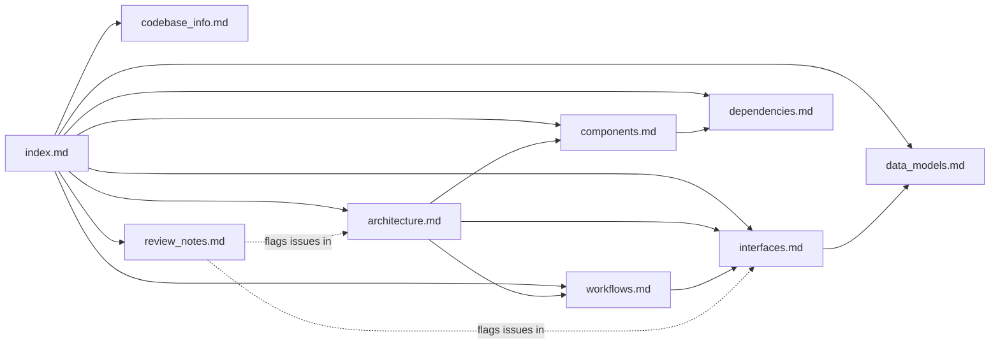

# Knowledge Base Index — Edo

<!--
This file is the primary entry point for AI assistants working on the Edo
codebase. It is designed to contain enough metadata that an assistant can,
by reading ONLY this file, decide which detailed document to load for a
given question. Every linked document is under `.agents/summary/` unless
stated otherwise.
-->

## How to Use This Index

1. Match the user's question against the **Topic → File** routing table below.
2. Read the indicated file(s) — each document stands alone.
3. If a question spans multiple topics, load `architecture.md` first (it cross-references everything).
4. For repository navigation tips and conventions, see the consolidated `AGENTS.md` at the repo root.
5. When code-level accuracy matters, always verify against the crate/module named in the docs — source paths are stable references.

## Topic → File Routing

| When the user asks about...                                         | Read                       |
| ------------------------------------------------------------------- | -------------------------- |
| What is edo / high-level pitch / tech stack / languages             | `codebase_info.md`         |
| How the pieces fit together / boundaries / Context+Scheduler+Plugin | `architecture.md`          |
| A specific crate, module, or builtin (e.g. `ScriptTransform`)       | `components.md`            |
| CLI flags, subcommands, `edo.toml` sections, trait signatures, WIT  | `interfaces.md`            |
| `Node`, `Addr`, `Artifact`, `Lock`, `TransformStatus`, schema       | `data_models.md`           |
| What happens during `edo run` / `edo checkout` / cache lookup / DAG | `workflows.md`             |
| External crates, AWS SDKs, wasmtime, container runtimes             | `dependencies.md`          |
| Known documentation bugs / gaps / Starlark-vs-TOML                  | `review_notes.md`          |
| Navigation tips, per-repo conventions, where to put new code        | `../AGENTS.md` (repo root) |

## File Manifest

### `codebase_info.md`

One-page factual overview of the project: identity, license, language stack (Rust 2024, tokio, wasmtime, TOML config), workspace layout (four crates + `edo-wit` WIT package), runtime directory conventions (`.edo/`, `edo.toml`, `edo.lock.json`), and the supported-kinds matrix for the builtin core plugin.

### `architecture.md`

The mental model. Explains that edo is organised around four traits (`Source`, `Environment`, `Transform`, `Backend`) coordinated by `Context` and executed by `Scheduler`, with a plugin boundary expressed in WIT and implemented either in-process (`edo-core-plugin`) or via wasmtime (`WasmPlugin`). Includes Mermaid diagrams for the top-level graph, plugin call sequence, and storage composition. Also documents known divergences from `README.md` / `docs/design.md`.

### `components.md`

Per-crate, per-module reference. Tables list every file in each subdirectory with its key type and role. Use this when locating where a concept lives (e.g. "where does `Handle` come from?" → `edo-core/src/context/handle.rs`). Includes the full list of built-in plugin kinds and a summary of the SDK's `Stub`.

### `interfaces.md`

Contract-level reference:

- CLI surface (flags, subcommands, `--arg K=V`).
- `edo.toml` schema (sections, kinds, Handlebars variables).
- All four major Rust traits (`Source`, `Environment`, `Farm`, `Transform`, `Backend`, `Plugin`) with their actual signatures.
- WIT package (`edo:plugin@1.0.0`) structure — `world edo`, host imports, guest exports, resource inventory.
- Addressing scheme with reserved addresses.

### `data_models.md`

Data-centric reference: the TOML schema as a class diagram, the generic `Node` tree, `Addr`, OCI-style `Artifact`/`Layer`/`Id`/`MediaType`/`Compression`, the composite `Storage` (local + source caches + build + output), `TransformStatus`, and the `Lock` file format (`edo.lock.json`). Also shows the root error hierarchy in `crates/edo/src/main.rs`.

### `workflows.md`

Operational sequences with Mermaid sequence diagrams:

1. Session bootstrap (`create_context`).
2. `edo run <addr>` end-to-end DAG execution.
3. `edo checkout` layer extraction (and the fact that it does not trigger a build).
4. `edo update` lock refresh.
5. Source fetch/cache priority.
6. Plugin creation (wasm vs in-process).
7. `ScriptTransform` stage/transform/shell-on-failure.
8. Container environment lifecycle.
9. Logging / progress.

### `dependencies.md`

Grouped inventory of every `[workspace.dependencies]` entry with its role in edo, plus the internal crate dependency graph and the external runtime requirements (container runtime, git, AWS credentials). Also flags `deny.toml` and the absence of CI / toolchain pinning.

### `review_notes.md`

Consistency and completeness report. Primary item: `README.md` / `docs/design.md` describe a Starlark configuration language, but the implementation uses TOML. Also notes README TODOs, a broken example, `.gitignore` lock pattern, `edo-wit` not being a Cargo member, and missing wasm plugin example.

## Relationships Between Documents

## Example Questions → Recommended Read Order

- "How do I add a new transform kind?" → `interfaces.md` (Transform trait + WIT) → `components.md` (how `ScriptTransform` is wired up) → `workflows.md` (creation flow).
- "Why is my `edo checkout` failing with 'artifact not found'?" → `workflows.md` § `edo checkout` (does not build) → `data_models.md` (Artifact/Id) → `components.md` (Storage).
- "Where is the S3 backend implemented?" → `components.md` → `crates/plugins/edo-core-plugin/src/storage/s3/`.
- "What's the relationship between Context and Scheduler?" → `architecture.md` → `components.md` § context & scheduler.
- "Can I configure the build cache?" → `data_models.md` § Storage Composite → `interfaces.md` § `[cache.*]` table.
- "Why does the README mention Starlark but the examples use TOML?" → `review_notes.md` (item 1).

## Maintenance

- Regenerate this knowledge base by re-running the `codebase-summary` SOP.
- All files except `AGENTS.md`'s `Custom Instructions` section are auto-regenerable.
- If you change a trait signature in `edo-core`, update `interfaces.md`.
- If you add a new subcommand, update `interfaces.md` and add a flow in `workflows.md`.
- If you add a crate, update `codebase_info.md`, `components.md`, and `dependencies.md`.
