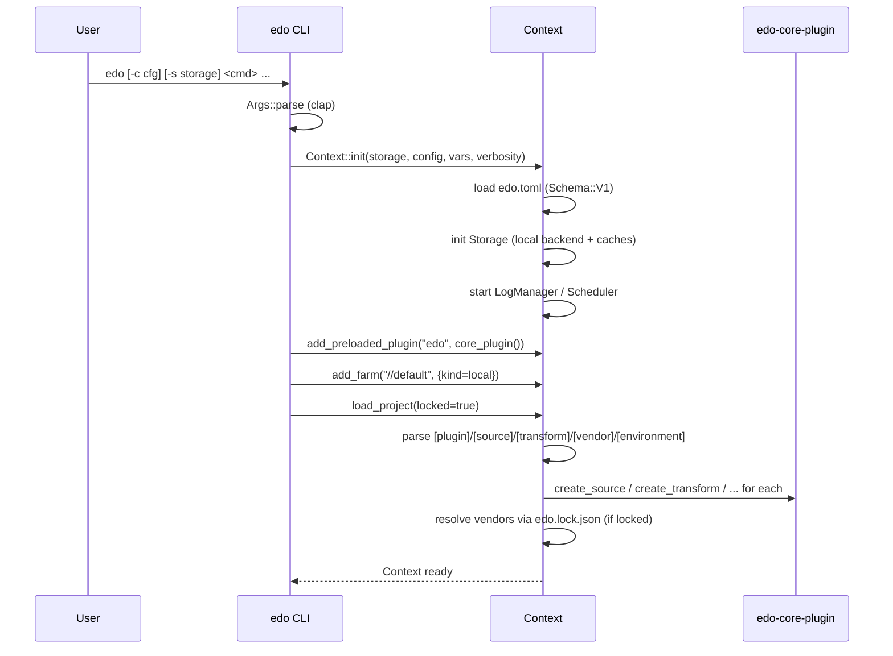
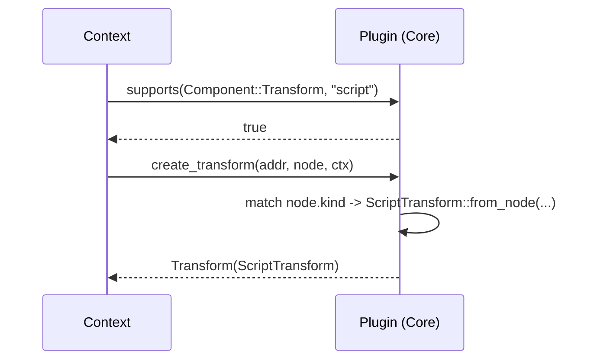

# Workflows

## 1. Session Bootstrap (`edo <cmd>` → ready `Context`)

Shared by every subcommand via `crates/edo/src/cmd/mod.rs::create_context`.



## 2. `edo run <addr>` — Build a Transform

```mermaid
sequenceDiagram
    participant CLI
    participant Ctx as Context
    participant Sched as Scheduler
    participant G as Graph
    participant T as Transform
    participant F as Farm
    participant E as Environment
    participant S as Storage

    CLI->>Ctx: ctx.run(&addr)
    Ctx->>Sched: run(ctx, addr)
    Sched->>G: Graph::new(workers); add(ctx, addr)
    G->>T: walk depends() recursively
    Sched->>G: fetch(ctx)   // pull all Sources into storage
    Sched->>G: run(path, ctx, addr)
    loop for each ready node
        G->>T: get_unique_id(handle)
        G->>S: has(id)?
        alt cache hit
            S-->>G: Artifact
        else cache miss
            G->>T: prepare(log, handle)
            G->>T: environment()  // Addr
            G->>F: create(log, workdir)
            F-->>G: Environment
            G->>E: setup + up
            G->>T: stage(log, handle, env)
            G->>T: transform(log, handle, env)
            T-->>G: TransformStatus
            G->>E: down + clean
            alt Success(artifact)
                G->>S: save(artifact)
            else Failed/Retryable
                G->>G: record failure, optionally retry
            end
        end
    end
    Sched-->>Ctx: ok
```

## 3. `edo checkout <addr> <out>` — Extract Artifact Layers

Implementation: `crates/edo/src/cmd/checkout.rs`.

1. Bootstrap context (locked).
2. Resolve target transform → `get_unique_id(handle)`.
3. `storage.safe_open(&id)` — **does not** trigger a build; the artifact must already exist. (Typical pattern: `edo run <addr>` first, then `edo checkout <addr> <out>`.)
4. For each layer with `MediaType::Tar(compression)`:
   - Pick decoder: `Bzip2 → BzDecoder`, `Lz → LzmaDecoder`, `Xz → XzDecoder`, `Gzip → GzipDecoder`, `Zstd → ZstdDecoder`, else raw.
   - Stream into `tokio_tar::Archive::unpack(out)`.
5. Non-tar layers are logged and skipped.

## 4. `edo update` — Refresh Lock File

Walks the project definitions, invokes registered `Vendor`s through the `resolvo` solver, and writes resolved `(Addr → Node)` map plus a content digest to `edo.lock.json`.

Subsequent commands run with `locked = true`, which skips re-resolution when the manifest digest matches.

## 5. Source Fetch / Cache

`Source::cache(log, storage)` is the standard path (NOT `fetch` directly):

```
cache(log, storage):
  id = get_unique_id()
  if storage.fetch_source(&id).is_some() -> return it
  else -> fetch(log, storage)
```

`fetch_source` synchronizes from any configured remote source cache into the local cache first.

## 6. Plugin Creation Flow



## 7. ScriptTransform Execution Detail

1. `stage` — copies the declared `source = [...]` artifacts into `{{build-root}}` inside the environment.
2. `transform` — renders each `commands` entry with Handlebars (variables include `{{install-root}}`, `{{build-root}}`, plus `--arg` values), then issues them to `Environment::cmd` / `Environment::run`.
3. On success, the contents of `{{install-root}}` are packed into an `Artifact` and saved.
4. On failure, if `can_shell()` returns true and the build was interactive, the user may be dropped into `shell(env)` at the working dir for debugging (see `dialoguer`-driven prompts).

## 8. Container Environment Lifecycle

`ContainerFarm::create` → `ContainerEnvironment`. Methods map to container CLI tools (Docker / Podman / Finch — via `which` crate detection):

- `setup`: ensure image is present locally (pull if missing).
- `up`: start a container with bind mounts for build/install roots.
- `cmd` / `run`: `<tool> exec` with env vars + workdir.
- `down`: stop the container.
- `clean`: remove the container.

## 9. Logging & Progress

- Top-level: `LogManager` installs a `tracing-subscriber` with env filter + `tracing-indicatif` progress layer.
- Per-task: each transform has a `Log` file handle under `.edo/`. Plugins write via `host.log.write(bytes)`.
- Verbosity is set once from CLI flags and threaded through `Context::init`.
