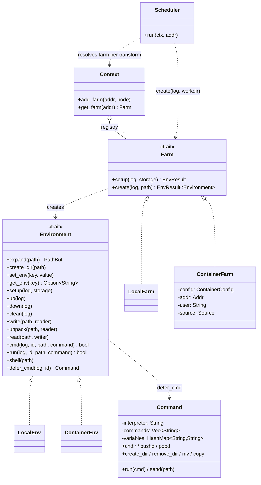

# Edo Environment Component - Detailed Design

## 1. Overview

The Environment component is one of Edo's four core architectural pillars
(alongside Storage, Source, and Transform). It provides flexible, pluggable
control over **where** and **how** build commands execute, enabling precise
environment configuration while maintaining reproducibility.

Concretely, a declarative `[environment.<name>]` TOML section registers a
**Farm** on the `Context`. When the `Scheduler` reaches a transform node, it
asks the transform for its `environment()` address, looks up the Farm, and
calls `Farm::create(...)` to obtain an `Environment` handle for the duration
of that single transform.

## 2. Core Responsibilities

1. **Environment Management** — creating, configuring, and tearing down build
   environments per transform invocation.
2. **Isolation Control** — providing configurable isolation between the build
   and the host system (e.g. container farms).
3. **File System Operations** — reading, writing, unpacking, and directory
   manipulation inside an environment.
4. **Command Execution** — running shell commands or pre-composed `Command`
   builders inside the environment.
5. **Platform Abstraction** — a single interface across host and container
   backends (Docker / Podman / Finch).

## 3. Component Architecture

### 3.1 Configuration (TOML)

Environments and farms are declared with `[environment.<name>]` tables keyed
by `kind`. Builtin kinds dispatched by `CorePlugin` are **`local`** and
**`container`**:

```toml
# A container-based build farm backed by an image source
[environment.gcc]
kind   = "container"
source = ["//hello_oci/gcc"]
# optional: pin the container runtime binary; default is auto-detect
# runtime = "podman"
# user    = "root"
```

Anything else (e.g. a chroot/bubblewrap/remote farm) is not built in.

There is also a reserved auto-registered farm at `//default` that the CLI
installs at startup (see `crates/edo/src/cmd/mod.rs`):

```rust
ctx.add_farm(
    &Addr::parse("//default").unwrap(),
    &Node::new_definition("environment", "local", "default", BTreeMap::new()),
).await?;
```

Transforms that do not specify `environment = "//..."` get this default local
farm.

### 3.2 Key Abstractions

#### 3.2.1 `Farm` trait

A `Farm` is a factory for `Environment` handles. One Farm is registered per
`[environment.<name>]` section; `create` is called per transform node.

```rust
#[async_trait]
pub trait Farm {
    /// One-time initialization for this farm (e.g. pull a base image).
    async fn setup(&self, log: &Log, storage: &Storage) -> EnvResult<()>;

    /// Create a fresh environment rooted at `path`.
    async fn create(&self, log: &Log, path: &Path) -> EnvResult<Environment>;
}
```

Declared with the `arc_handle` macro: implementations write `FarmImpl`, wrap
with `Farm::new(impl)`, and the resulting handle is `Clone + Send + Sync`.

#### 3.2.2 `Environment` trait

Full definition in `crates/edo-core/src/environment/mod.rs`. Its methods fall
into four groups:

```rust
#[async_trait]
pub trait Environment {
    // Path / filesystem
    async fn expand(&self, path: &Path) -> EnvResult<PathBuf>;
    async fn create_dir(&self, path: &Path) -> EnvResult<()>;
    async fn write(&self, path: &Path, reader: Reader) -> EnvResult<()>;
    async fn unpack(&self, path: &Path, reader: Reader) -> EnvResult<()>;
    async fn read(&self, path: &Path, writer: Writer) -> EnvResult<()>;

    // Env vars
    async fn set_env(&self, key: &str, value: &str) -> EnvResult<()>;
    async fn get_env(&self, key: &str) -> Option<String>;

    // Lifecycle
    async fn setup(&self, log: &Log, storage: &Storage) -> EnvResult<()>;
    async fn up(&self, log: &Log) -> EnvResult<()>;
    async fn down(&self, log: &Log) -> EnvResult<()>;
    async fn clean(&self, log: &Log) -> EnvResult<()>;

    // Execution
    async fn cmd(&self, log: &Log, id: &Id, path: &Path, command: &str) -> EnvResult<bool>;
    async fn run(&self, log: &Log, id: &Id, path: &Path, command: &Command) -> EnvResult<bool>;
    fn shell(&self, path: &Path) -> EnvResult<()>;
}

impl Environment {
    /// Start building a deferred `Command` bound to this environment.
    pub fn defer_cmd(&self, log: &Log, id: &Id) -> Command;
}
```

Typical lifecycle driven by the `Scheduler`:

```
Farm::create(log, workdir)
    → Environment::setup(log, storage)
    → Environment::up(log)
    → (write / unpack / set_env / cmd / run / read)*
    → Environment::down(log)
    → Environment::clean(log)
```

#### 3.2.3 `Command` — deferred build command

`Command` (in `crates/edo-core/src/environment/command.rs`) is a scriptable
builder returned from `Environment::defer_cmd(log, id)`. It accumulates a
shell script (interpreter `bash` by default) with Handlebars variable
substitution, then emits it through `Environment::run` via `send`.

```rust
#[derive(Clone)]
pub struct Command {
    id: Id,
    env: Environment,
    log: Log,
    interpreter: String,
    commands: Vec<String>,
    variables: HashMap<String, String>,
}

impl Command {
    pub fn new(log: &Log, id: &Id, env: &Environment) -> Self { /* ... */ }

    pub fn set_interpreter(&mut self, interpreter: &str);
    pub fn set(&mut self, key: &str, value: &str) -> EnvResult<()>;

    pub fn chdir(&mut self, path: &str) -> EnvResult<()>;
    pub fn pushd(&mut self, path: &str) -> EnvResult<()>;
    pub fn popd(&mut self);

    pub async fn create_dir(&mut self, path: &str) -> EnvResult<()>;
    pub async fn create_named_dir(&mut self, key: &str, path: &str) -> EnvResult<()>;
    pub async fn remove_dir(&mut self, path: &str) -> EnvResult<()>;
    pub async fn remove_file(&mut self, path: &str) -> EnvResult<()>;
    pub async fn mv(&mut self, from: &str, to: &str) -> EnvResult<()>;
    pub async fn copy(&mut self, from: &str, to: &str) -> EnvResult<()>;

    pub async fn run(&mut self, cmd: &str) -> EnvResult<()>;
    pub async fn send(&self, path: &str) -> EnvResult<()>;
}
```

Key points:

- **Command aggregation** — builds up a sequence executed as one script.
- **Handlebars templating** — `{{var}}` references substituted against
  `variables`. Script transforms observe at least `{{install-root}}` and
  `{{build-root}}`.
- **Environment-bound** — every `Command` carries the `Environment` and `Log`
  it will eventually execute under via `send`.

> There is **no** `NetworkAccess` enum or resource-limit struct in the current
> core. Network and resource policy, if needed, are handled by the
> implementation of a specific Farm (e.g. flags passed to the container CLI)
> or left to future extensions.

### 3.3 Component Structure



## 4. Key Interfaces

### 4.1 Farm Interface

```rust
#[async_trait]
pub trait Farm {
    async fn setup(&self, log: &Log, storage: &Storage) -> EnvResult<()>;
    async fn create(&self, log: &Log, path: &Path) -> EnvResult<Environment>;
}
```

Responsibilities:

1. **One-time setup** — e.g. ensure a base container image is present.
2. **Environment creation** — produce a fresh `Environment` for one transform,
   rooted at the workdir the scheduler hands out.
3. **No cross-environment sharing of mutable state** — each `create` call
   should yield an independent handle.

### 4.2 Environment Interface

See section 3.2.2. Grouped semantics:

1. **Lifecycle**: `setup`, `up`, `down`, `clean`.
2. **File system**: `expand`, `create_dir`, `write`, `unpack`, `read`.
3. **Env vars**: `set_env`, `get_env`.
4. **Execution**: `cmd` (one-shot shell string), `run` (deferred `Command`),
   `shell` (drop user into interactive shell — used by
   `Transform::shell(env)` for debugging when `can_shell()` is true).

## 5. Implementation Details

### 5.1 Registration flow

1. `Project` loads `edo.toml` and iterates `[environment.<name>]` tables.
2. For each section it calls `Context::add_farm(addr, node)`; the Context
   asks each loaded `Plugin` whether it `supports(Component::Environment,
kind)` and dispatches to `Plugin::create_farm(addr, node, ctx)`.
3. `CorePlugin` (in-process) matches `kind` against `local` / `container` and
   constructs `LocalFarm` or `ContainerFarm` accordingly.
4. The CLI additionally registers `//default` as a `local` farm at startup so
   transforms without an explicit `environment` still run.

### 5.2 `LocalFarm` / `LocalEnv`

Source: `crates/plugins/edo-core-plugin/src/environment/local.rs`.

- **Farm** is zero-config (`non_configurable!`). `setup` is a no-op.
  `create(log, path)` returns a `LocalEnv { path, env: DashMap<String,String> }`.
- **LocalEnv** runs commands on the host using the helpers in
  `edo_core::util::cmd`. `expand` canonicalizes any path to live under the
  environment root (rejecting absolute paths outside it). `set_env`/`get_env`
  use an in-memory `DashMap`. `up`/`down`/`clean` are largely trivial because
  the host is always up; `clean` removes the root.
- No sandboxing, no network isolation, no resource limits — it is literally
  the host.

### 5.3 `ContainerFarm` / `ContainerEnv`

Source: `crates/plugins/edo-core-plugin/src/environment/container.rs`.

- **Config** (`ContainerConfig`): `runtime: Option<String>` from TOML; the
  resolved `cli: PathBuf` is discovered via the `which` crate. If `runtime`
  is set it must resolve; otherwise the farm probes **podman → finch →
  docker** in order.
- **Construction** (`FromNode`): reads `user` (default `"root"`) and a
  required `source = [...]` list whose first entry is added to the context as
  a regular `Source` — this is the base image. The farm stores the
  `Addr`/`Source`/`user` for later.
- **`Farm::setup`**: `cache`s the image source into storage and tags it with
  a name derived from the addr (`edo-<addr with / replaced>`).
- **`Farm::create`** returns a `ContainerEnv` that delegates all operations
  to the resolved container CLI:
  - `up`: start a container with bind mounts for build/install roots.
  - `cmd` / `run`: `<cli> exec` with env vars and working directory.
  - `down`: stop the container.
  - `clean`: remove the container.

Network policy, privileges, volume mounts beyond the workdir, seccomp/LSM
profiles, and resource limits are **not** currently surfaced in the TOML
schema. They would need to be added either to `ContainerConfig` or delegated
to a third-party extension.

### 5.4 Note on sandboxing backends

Earlier design sketches mentioned chroot / user-namespace / bubblewrap
farms. None of those are implemented in the current tree — they remain
**planned** extension points. The only builtin farms are `local` and
`container`.

## 6. Security Considerations

The current implementation deliberately keeps security policy out of the
trait surface: isolation is whatever the chosen Farm provides.

- `LocalFarm`: no isolation. Runs with the user's privileges. Appropriate for
  trusted local builds only.
- `ContainerFarm`: isolation is whatever the container runtime gives you by
  default (namespaces, cgroups). There is no TOML-level knob yet for network
  mode, read-only mounts, seccomp, user namespaces, or resource caps. Anyone
  needing those today will find they are not currently available.

Planned enhancements — network ACLs, resource limits, user-namespace
remapping, seccomp/AppArmor/SELinux profiles — are listed under Future
Enhancements (§9). Do not assume any of them are enforced by the current
code.

## 7. Error Handling

The real error type is `EnvironmentError` in
`crates/edo-core/src/environment/error.rs`:

```rust
pub type EnvResult<T> = Result<T, EnvironmentError>;
```

It uses `snafu` with `#[snafu(transparent)]` bubbling to surface errors from
storage, source, command execution, and template rendering. Notable variants
exercised in the builtin farms include: `NoRuntime` (no container CLI
found), `NoSource` (container farm missing `source`), `Source { source: ... }`
(failure fetching the image), `Mutate { path }` (LocalEnv refusing to touch
a path outside its root), `Absolute { source }` (path canonicalization
failure), `Template { source }` (Handlebars rendering failure in `Command`),
and `Run` (a `Command::send` whose underlying `run` returned `false`).

## 8. Testing Strategy

1. **Unit tests** per environment implementation — file ops, command
   execution, env vars, lifecycle ordering.
2. **Integration tests** — round-trip a transform through the Scheduler
   using both `local` and `container` farms.
3. **Container tests** — at least one runtime (podman/finch/docker) must be
   installed; auto-detection via `which` decides which is exercised.
4. **Command tests** — parity checks for the `command` resource.

## 9. Future Enhancements

The following are not implemented today:

### 9.1 Additional builtin farms

- **chroot / user-namespace / bubblewrap** — lightweight Linux sandboxing.
- **Remote farms** — SSH, cluster, or cloud-hosted workers.

### 9.2 Richer container policy in TOML

- Network mode (`none` / `full` / allow-list of hosts).
- CPU / memory / disk caps.
- Read-only and tmpfs mounts, additional volumes, privileged mode.
- Custom seccomp / AppArmor / SELinux profiles, user-namespace remapping.

### 9.3 Environment templates & pooling

- Shareable `[environment]` presets (e.g. common toolchain images).
- Warm / pooled environments for faster startup on incremental builds.

## 10. Conclusion

The Environment component gives Edo pluggable control over where transforms
execute. Its contract is intentionally small — a `Farm` factory plus a
lifecycle-oriented `Environment` trait with a deferred `Command` builder —
which keeps the `Context` + `Scheduler` wiring uniform across host, container,
and future backends. Today those backends are limited to the
builtin `local` and `container` farms;
richer isolation and policy live in the Future Enhancements list rather
than in the current code.
