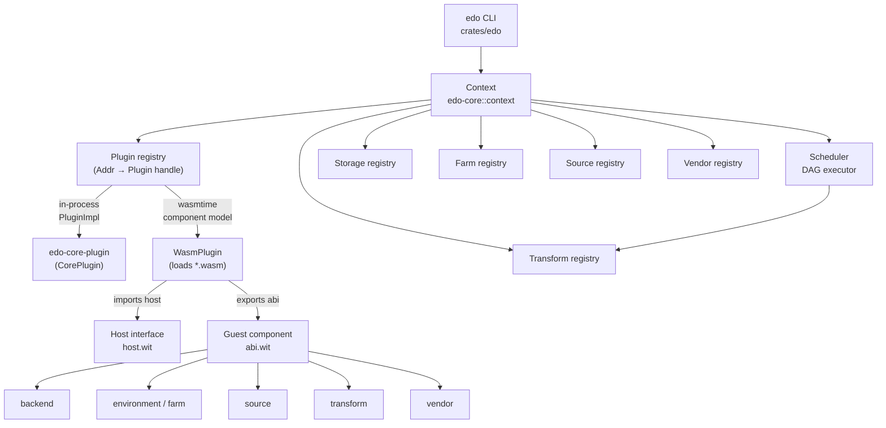
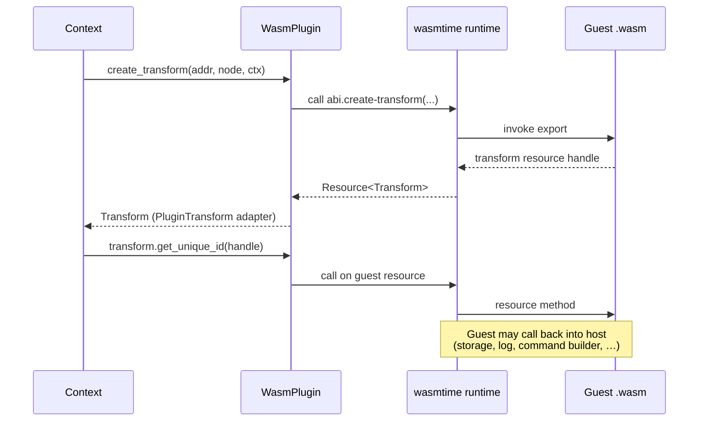

# Edo Plugin System Design

## 1. Overview

The Plugin System is a core architectural feature of Edo that enables extensibility across all pluggable abstractions (Storage, Source, Environment, Transform, Vendor). Plugins are delivered either **in-process** (Rust crates implementing `PluginImpl`) or as **WebAssembly Component Model** modules loaded by the host at runtime. This document details how plugins are declared, discovered, loaded, and executed within Edo.

## 2. Core Objectives

1. **Component Extensibility**: Allow extension of all core abstractions — `Backend` (storage), `Source`, `Vendor`, `Farm`/`Environment`, `Transform`.
2. **Multi-implementation Support**: Enable a single plugin to provide multiple implementations across different component kinds, dispatched by a `supports(component, kind)` predicate.
3. **Language Agnosticism**: Any language that can target the WebAssembly Component Model and produce a `world edo` component can implement a plugin.
4. **Security**: WebAssembly sandbox plus a narrow, explicitly-declared host interface.
5. **Unified surface**: The same `Plugin` handle type is used for both the builtin in-process plugin and wasm components.

## 3. Architecture Overview

### 3.1 Plugin System Components



The pipeline is split across two coordinators:

- **`Context`** (`edo-core/src/context/mod.rs`) owns configuration (`edo.toml`), lock state (`edo.lock.json`), the plugin registry, storage, and per-kind registries for farms/sources/transforms/vendors. It is the sole entry point through which plugins create component handles.
- **`Scheduler`** (`edo-core/src/scheduler/mod.rs`) turns a target transform address into a `Graph` of dependencies and drives execution across a pool of worker tasks. It does **not** talk to plugins directly; it resolves handles via the `Context`.

### 3.2 Key Abstractions

#### 3.2.1 `Plugin` trait (host side)

Every plugin — in-process or wasm — is exposed through the same `arc_handle` trait defined in `crates/edo-core/src/plugin/mod.rs`:

```rust
#[arc_handle]
#[async_trait]
pub trait Plugin {
    async fn fetch(&self, log: &Log, storage: &Storage) -> Result<()>;
    async fn setup(&self, log: &Log, storage: &Storage) -> Result<()>;
    async fn supports(&self, ctx: &Context, component: Component, kind: String) -> Result<bool>;
    async fn create_storage(&self,   addr: &Addr, node: &Node, ctx: &Context) -> Result<Backend>;
    async fn create_farm(&self,      addr: &Addr, node: &Node, ctx: &Context) -> Result<Farm>;
    async fn create_source(&self,    addr: &Addr, node: &Node, ctx: &Context) -> Result<Source>;
    async fn create_transform(&self, addr: &Addr, node: &Node, ctx: &Context) -> Result<Transform>;
    async fn create_vendor(&self,    addr: &Addr, node: &Node, ctx: &Context) -> Result<Vendor>;
}
```

The `#[arc_handle]` macro generates a `Plugin` handle newtype (`Arc<dyn PluginImpl>`) and a `PluginImpl` implementation trait. `Plugin::new(impl)` wraps any `PluginImpl` in the handle.

#### 3.2.2 In-process plugin — `CorePlugin`

`crates/plugins/edo-core-plugin` provides the builtin implementation. It is **not** a wasm component; it is a plain Rust crate that implements `PluginImpl` directly. Its `supports` method encodes the full builtin kind table, and each `create_*` method dispatches on `node.get_kind()`:

| Component       | Built-in kinds                              |
| --------------- | ------------------------------------------- |
| Storage backend | `s3`                                        |
| Environment     | `local`, `container`                        |
| Source          | `git`, `local`, `image`, `remote`, `vendor` |
| Transform       | `compose`, `import`, `script`               |
| Vendor          | `image`                                     |

The CLI's `create_context` registers `core_plugin()` under the bare address `edo` and auto-registers a `//default` `local` farm before loading the project.

#### 3.2.3 Wasm plugin — `WasmPlugin`

`WasmPlugin` (same file) stores a `Source` handle to the plugin's `.wasm` artifact. When first used it:

1. Resolves the artifact via `Source::get_unique_id` + `Storage::safe_open`.
2. Reads the single layer and compiles it into a `wasmtime::component::Component`.
3. Instantiates it under a `Store<host::Host>` whose `Linker` binds every resource in `host.wit`.
4. Caches the resulting `Arc<bindings::Edo>` + `Arc<Mutex<Store<_>>>` for subsequent calls.

Each `create_*` call on `Plugin` forwards to the guest export (`abi::create-storage`, `abi::create-farm`, …). The returned guest resource handle is then wrapped by one of the adapter types in `crates/edo-core/src/plugin/impl_/` (`PluginBackend`, `PluginFarm`, `PluginSource`, `PluginTransform`, `PluginVendor`, `PluginHandle`), which implement the native `edo-core` `*Impl` traits and marshal every call back into wasmtime.

#### 3.2.4 Plugin Registry

The `Context` keeps a `BTreeMap<Addr, Plugin>` of registered plugins. Resolution of a user `[source]` / `[transform]` / `[environment]` / `[vendor]` / `[cache]` entry walks the registry and dispatches to the first plugin whose `supports(component, kind)` returns `true`.

## 4. Plugin Declaration and Loading

### 4.1 Plugin Declaration

Plugins are declared in `edo.toml` under `[plugin.<name>]` tables. The schema is handled by `crates/edo-core/src/context/schema.rs::SchemaV1::get_plugins`, which wraps the table as a `Node` with `id = "plugin"`, `kind = <kind>`, and `name = <name>`.

Each entry requires a `kind` and a `source` (or `requires`) field whose value is a **list containing one inline source node** describing how to fetch the `.wasm` artifact. `WasmPlugin::from_node` (see `plugin/mod.rs`) extracts that list's first entry and calls `ctx.add_source(addr, &source)`.

Example — fetching a wasm plugin from a remote URL:

```toml
schema-version = "1"

[plugin.my-plugin]
kind = "wasm"
source = [
    { kind = "remote", url = "https://example.com/plugins/my-plugin-1.0.0.wasm" },
]
```

Example — pulling a plugin from a local path:

```toml
[plugin.docker-env]
kind = "wasm"
source = [
    { kind = "local", path = "vendor/docker-env-1.2.0.wasm", is_archive = false },
]
```

Example — pulling a plugin from git:

```toml
[plugin.rust-wasm]
kind = "wasm"
source = [
    { kind = "git", url = "https://github.com/example/rust-wasm-plugin.git", rev = "v0.9.0" },
]
```

Note that the plugin _declaration_ supplies only a handle to the wasm artifact. Per-use configuration (bucket, image, flags, …) lives on the `[storage]` / `[environment]` / `[source]` / `[transform]` / `[vendor]` entry that later requests the plugin.

### 4.2 Plugin Resolution

1. `Project::collect` walks every `edo.toml` in the workspace and records each `[plugin.<name>]` as a pending registration.
2. `Project::apply` iterates the collected plugins and calls `ctx.add_plugin(addr, node)` for each (see `crates/edo-core/src/context/builder.rs`).
3. `ctx.add_plugin` builds a `WasmPlugin` via `FromNode`, which in turn registers the plugin's artifact source with the context.
4. The source is resolved and the `.wasm` artifact is fetched into the local storage backend (`//edo-local-cache`) on demand.

Note: plugins _cannot_ depend on vendored sources — they must be resolvable before vendors run, since vendors themselves may be provided by plugins.

### 4.3 Plugin Loading

1. On first component creation, `WasmPlugin::load` reads the artifact's layer via `Storage::safe_read`.
2. `wasmtime::component::Component::new` validates and compiles the wasm component.
3. A `Linker` is built that wires every `host` resource and helper function (`info` / `warn` / `fatal`).
4. `bindings::Edo::instantiate_async` produces the guest instance; the resulting `Edo` + `Store` pair is cached inside the plugin.

## 5. Interface Design — WIT Package `edo:plugin@1.0.0`

The plugin contract lives in `crates/edo-wit/` as a pure `.wit` package (it is **not** a Cargo crate; it has no `Cargo.toml`). The host consumes it through `wasmtime::component::bindgen!` and the guest through `wit-bindgen`.

### 5.1 World

`edo.wit`:

```wit
package edo:plugin@1.0.0;

world edo {
    use host.{node, error};
    import host;

    export abi;
}
```

The world is deliberately flat: plugins **import** the `host` interface (host-owned resources they can call into) and **export** the `abi` interface (guest-owned resources and factory functions the host calls).

### 5.2 Host Interface (imported by the guest)

Defined in `host.wit`. The host provides:

- `enum component { storage-backend, environment, source, transform, vendor }`
- I/O: `resource reader`, `resource writer`
- Identity / artifacts: `resource id`, `resource layer`, `resource artifact-config`, `resource artifact`, `resource storage`
- Config: `resource config` (`get(name) -> option<node>`)
- Logging: `resource log` with `write`; free functions `info`, `warn`, `fatal`
- Command building: `resource command` (`set`, `chdir`, `pushd`, `popd`, `create-named-dir`, `create-dir`, `remove-dir`, `remove-file`, `mv`, `copy`, `run`, `send`)
- Build envs: `resource environment` (the host's live environment), `resource farm`
- Source / transform handles the host can hand back into the guest: `resource source`, `resource transform`, `resource handle`
- Build context: `resource context` (`get-arg`, `get-handle`, `config`, `storage`, `get-transform`, `get-farm`, `add-source`)
- Config payload: `resource node` (`validate-keys`, `as-bool` / `as-int` / `as-float` / `as-string` / `as-version` / `as-require` / `as-list` / `as-table`, `get-id` / `get-kind` / `get-name` / `get-table`) and `record definition { id, kind, name, table }`
- Error type: `resource error` (`constructor(plugin, message)`, `to-string`)
- Shared status: `variant transform-status { success(artifact), retryable(tuple<option<string>, error>), failed(tuple<option<string>, error>) }`

All paths the host may hand to a guest are referenced via borrowed resource handles — guests never get raw pointers or arbitrary FS access.

### 5.3 Guest ABI (exported by the plugin)

Defined in `abi.wit`. Each plugin exports six resource types plus six top-level functions:

```wit
interface abi {
    use host.{ /* everything the guest needs */ };

    resource backend     { /* ls, has, open, save, del, copy, prune,
                              prune-all, read, start-layer, finish-layer */ }
    resource environment { /* expand, create-dir, set-env, get-env, setup,
                              up, down, clean, write, unpack, read, cmd,
                              run, shell */ }
    resource farm        { /* setup, create */ }
    resource source      { /* get-unique-id, fetch, stage */ }
    resource transform   { /* environment, depends, get-unique-id, prepare,
                              stage, transform, can-shell, shell */ }
    resource vendor      { /* get-options, resolve, get-dependencies */ }

    supports: func(component: component, kind: string) -> bool;

    create-storage:   func(addr: string, node: borrow<node>, ctx: borrow<context>) -> result<backend,     error>;
    create-farm:      func(addr: string, node: borrow<node>, ctx: borrow<context>) -> result<farm,        error>;
    create-source:    func(addr: string, node: borrow<node>, ctx: borrow<context>) -> result<source,      error>;
    create-transform: func(addr: string, node: borrow<node>, ctx: borrow<context>) -> result<transform,   error>;
    create-vendor:    func(addr: string, node: borrow<node>, ctx: borrow<context>) -> result<vendor,      error>;
}
```

Key points:

- Each guest resource mirrors the native Rust `*Impl` trait in `edo-core`. Methods on the wasm resource correspond 1:1 with methods on the adapter type in `crates/edo-core/src/plugin/impl_/`.
- `supports(component, kind)` is the single dispatch predicate the host uses when resolving a user `kind = "…"`.
- The guest is free to return an `error` from any factory that does not understand the given kind.
- The `transform` resource's `transform(...)` method returns `transform-status`, not a `result<_, error>`, so a transform can cleanly signal `retryable` vs `failed` without exceptions crossing the boundary.

## 6. Plugin Implementation

### 6.1 Guest SDK — `edo-plugin-sdk`

Third-party plugin authors depend on `crates/edo-plugin-sdk`, which:

- Re-exports `wit-bindgen`-generated `bindings` for `edo:plugin@1.0.0`.
- Provides a `stub::Stub` type that implements every `Guest*` trait from `abi.wit` with a `NotImplemented` error so authors only implement the resources they actually need.

### 6.2 Example Plugin (Rust, wasm component)

```rust
use edo_plugin_sdk::bindings::exports::edo::plugin::abi;
use edo_plugin_sdk::bindings::edo::plugin::host::{Component, Node, Context, Error};
use edo_plugin_sdk::stub::Stub;

struct MyStorageBackend { /* … */ }

impl abi::GuestBackend for MyStorageBackend {
    // Implement ls / has / open / save / del / copy / prune /
    // prune-all / read / start-layer / finish-layer.
}

struct MyExports;

impl abi::Guest for MyExports {
    type Backend     = MyStorageBackend;
    type Environment = <Stub as abi::Guest>::Environment;
    type Farm        = <Stub as abi::Guest>::Farm;
    type Source      = <Stub as abi::Guest>::Source;
    type Transform   = <Stub as abi::Guest>::Transform;
    type Vendor      = <Stub as abi::Guest>::Vendor;

    fn supports(component: Component, kind: String) -> bool {
        matches!(component, Component::StorageBackend) && kind == "my-backend"
    }

    fn create_storage(addr: String, node: &Node, ctx: &Context)
        -> Result<abi::Backend, Error>
    {
        let backend = MyStorageBackend::from_node(&addr, node, ctx)?;
        Ok(abi::Backend::new(backend))
    }

    fn create_farm(_: String, _: &Node, _: &Context)      -> Result<abi::Farm,      Error> { Stub::create_farm(_1, _2, _3)      }
    fn create_source(_: String, _: &Node, _: &Context)    -> Result<abi::Source,    Error> { Stub::create_source(_1, _2, _3)    }
    fn create_transform(_: String, _: &Node, _: &Context) -> Result<abi::Transform, Error> { Stub::create_transform(_1, _2, _3) }
    fn create_vendor(_: String, _: &Node, _: &Context)    -> Result<abi::Vendor,    Error> { Stub::create_vendor(_1, _2, _3)    }
}

edo_plugin_sdk::bindings::export!(MyExports with_types_in edo_plugin_sdk::bindings);
```

Compile with a component-model-capable target (e.g. `cargo build --target wasm32-wasip2`) and distribute the resulting `.wasm`.

### 6.3 In-process plugins

Writing a builtin-style plugin means implementing `PluginImpl` on a Rust type, wrapping it with `Plugin::new(MyPlugin)`, and registering the resulting handle with the context during bootstrap. `crates/plugins/edo-core-plugin/src/lib.rs` is the reference implementation — there is no wasm toolchain step for this path.

## 7. Plugin Lifecycle

### 7.1 Declaration → Registration

1. `SchemaV1` parses `[plugin.<name>]` entries from every `edo.toml` in the project.
2. `Project::apply` registers each plugin with the `Context` under `//<project>/<name>`.
3. The plugin's artifact source is registered with the `Context` so it can be resolved like any other source.

### 7.2 Fetch + Setup

1. Before scheduling starts, `Context` calls `Plugin::fetch` for every registered plugin — `WasmPlugin::fetch` pulls the `.wasm` artifact into `//edo-local-cache` via `Source::cache`.
2. `Plugin::setup` is then called, giving each plugin a chance to perform one-time initialisation.

### 7.3 Component Creation

1. When `Context` resolves a `[storage]` / `[environment]` / `[source]` / `[transform]` / `[vendor]` entry, it iterates the plugin registry and calls `supports(component, kind)` on each.
2. The first matching plugin's `create_*` is called with the entry's `Addr` + `Node` + `Context`.
3. For `WasmPlugin`, the call crosses the wasm boundary; the returned resource is wrapped in a `PluginBackend` / `PluginFarm` / `PluginSource` / `PluginTransform` / `PluginVendor` adapter (see `crates/edo-core/src/plugin/impl_/`).



### 7.4 Execution

The `Scheduler` drives the DAG and invokes methods on the component handles. For wasm plugins, every call is marshalled through wasmtime and back. The host may pass host-owned resources (`log`, `storage`, `environment`, `handle`, `id`) to the guest by borrowed reference, and the guest may call back into them.

### 7.5 Teardown

The `Context` drops the plugin registry at the end of the session; wasmtime stores and components are released with their owning `WasmPlugin`.

## 8. Security Model

### 8.1 Isolation

WebAssembly provides strong isolation:

- Linear memory is not shared with the host.
- The only functions the guest can call are those explicitly bound in the `host` linker.
- No ambient filesystem or network access — guests interact with artifacts through the host's `storage`, `environment`, and `command` resources.

### 8.2 Capability Surface

Every capability a plugin needs is expressed as a resource it receives by borrowed reference from the host. There is no `wasi:filesystem`, no sockets, and no clocks enabled by default — the host only wires what `host.wit` declares.

### 8.3 Resource Limits

The `wasmtime::Store<host::Host>` is the natural place to attach fuel, memory caps, and epoch-based interruption; policies live on the host side and are invisible to guests.

### 8.4 Type Safety

The component model's type system (WIT) validates parameter passing at instantiation time. Resource handles cannot be forged by a guest; each handle is tracked by wasmtime's resource table.

## 9. Plugin Usage Examples

All examples below assume the plugin has been declared as shown in §4.1. The declaration binds a name; user entries reference that name by setting `kind` (and any parameters the plugin requires).

### 9.1 Custom Storage Backend

```toml
[plugin.s3-storage]
kind   = "wasm"
source = [{ kind = "remote", url = "https://example.com/plugins/s3-storage-1.0.0.wasm" }]

[cache.build]
kind   = "s3"
bucket = "my-build-artifacts"
region = "us-west-2"
prefix = "builds/"
```

(`kind = "s3"` is already satisfied by the builtin `edo-core-plugin`; the snippet above demonstrates the _shape_ of a plugin-backed cache entry — swap `"s3"` for whatever `supports` value the wasm plugin advertises.)

### 9.2 Custom Environment Farm

```toml
[plugin.docker-env]
kind   = "wasm"
source = [{ kind = "remote", url = "https://example.com/plugins/docker-env-1.2.0.wasm" }]

[environment.ubuntu-build]
kind     = "docker"
image    = "ubuntu:20.04"
packages = ["build-essential", "cmake", "python3"]

[environment.ubuntu-build.env]
DEBIAN_FRONTEND = "noninteractive"

[transform.my-app]
kind        = "script"
environment = "//example/ubuntu-build"
source      = ["//example/src"]
commands    = ["make"]
```

### 9.3 Custom Transform

```toml
[plugin.rust-wasm]
kind   = "wasm"
source = [{ kind = "remote", url = "https://example.com/plugins/rust-wasm-0.9.0.wasm" }]

[transform.my-wasm-component]
kind        = "rust-wasm"
environment = "//example/host"
source      = ["//example/src"]
target      = "wasm32-unknown-unknown"
wasi        = true
opt_level   = "s"
```

### 9.4 Custom Vendor

Compare with the builtin `[vendor.public-ecr]` shape from `examples/hello_oci/edo.toml`:

```toml
[plugin.cargo-vendor]
kind   = "wasm"
source = [{ kind = "remote", url = "https://example.com/plugins/cargo-vendor-0.1.0.wasm" }]

[vendor.crates-io]
kind    = "cargo"
index   = "https://github.com/rust-lang/crates.io-index"
```

## 10. Implementation Considerations

### 10.1 Plugin Development Experience

- The canonical SDK is `crates/edo-plugin-sdk` for Rust guests.
- Any language with a WIT / component-model toolchain (e.g. `jco` for JS, `wit-bindgen` for C / C++ / TinyGo) can produce a valid `edo:plugin@1.0.0` component.
- `Stub` defaults let authors implement only the resources they care about.

### 10.2 Plugin Distribution

Plugins are plain `.wasm` files fetched through any of Edo's built-in source kinds (`remote`, `git`, `local`, `image`). A plugin declared with `kind = "wasm"` and a `source = [...]` list can therefore live wherever its source kind can live.

### 10.3 Plugin Versioning

Plugin versioning is driven by whatever source kind the plugin uses: git refs / tags, remote URLs with embedded versions, OCI image tags, etc. The WIT package carries its own semver (`edo:plugin@1.0.0`) and must match between host and guest.

### 10.4 Performance Considerations

- Wasmtime uses ahead-of-time compilation via cranelift; compiled components are cached per `WasmPlugin` for the duration of a build session.
- Host/guest calls are synchronous from the guest's perspective; the host-side adapter layer (`impl_/`) bridges them into `async` trait methods using a mutex-guarded `Store`.
- For hot paths (e.g. thousands of transforms) an in-process `PluginImpl` will always beat a wasm implementation.

## 11. Future Considerations

### 11.1 Plugin Registry

A centralised index for sharing and discovering plugins: searchable catalog, version metadata, signing, automated smoke tests.

### 11.2 Richer Component Composition

The component model allows linking multiple components together at load time. A future revision could compose third-party plugins with reusable helper components supplied by Edo.

### 11.3 Enhanced Security Features

- Per-plugin fuel / memory policies.
- Signature verification on plugin artifacts.
- Runtime auditing of host calls.

### 11.4 Cross-Language Development

Templates and CI recipes for producing `edo:plugin@1.0.0` components in languages beyond Rust.

## 12. Conclusion

The Edo Plugin System gives a single, uniform surface (`Plugin` / `PluginImpl`) for both the in-process builtin (`edo-core-plugin`) and arbitrary wasm components speaking `edo:plugin@1.0.0`. Declarations live in `edo.toml` under `[plugin.<name>]`, resolution and scheduling are split between `Context` and `Scheduler`, and the host ↔ guest contract is fully captured by `crates/edo-wit/{edo,host,abi}.wit`. Authors targeting the wasm boundary build against `edo-plugin-sdk`; anyone wanting native performance can implement `PluginImpl` directly.
