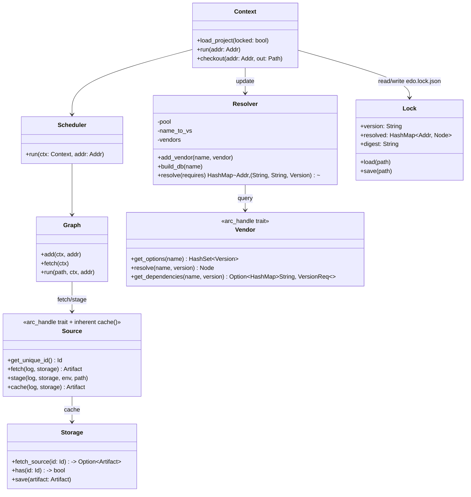

# Edo Source Component — Detailed Design

## 1. Overview

The Source component is one of Edo's four pluggable pillars (alongside
**Storage**, **Environment**, and **Transform**). It is responsible for
obtaining external code and binary artifacts and publishing them into the
shared `Storage` so that `Transform`s can consume deterministic inputs.

Declarations live in `edo.toml` (schema v1):

- `[source.<n>]` tables register concrete `Source` handles keyed as
  `//<project>/<n>`.
- `[vendor.<n>]` tables register `Vendor` handles used to **resolve** names
  and version requirements into concrete source nodes.
- `[requires.<n>]` tables declare vendored dependencies (a `(name,
version-req)` pair that the resolver must satisfy).

The umbrella project (`examples/edo.toml`) only carries `schema-version =
"1"`; individual examples under `examples/hello_rust` and
`examples/hello_oci` show the real shapes.

## 2. Core Responsibilities

1. **Source Acquisition** — fetching external code/artifacts from Git, HTTP,
   OCI registries, the local tree, or a resolved vendor.
2. **Dependency Resolution** — turning `[requires.*]` entries into concrete
   versions across every registered `Vendor`, producing `edo.lock.json`.
3. **Vendor Management** — pluggable lookup of available versions, transitive
   dependencies, and concrete source `Node`s for a `(name, version)` pair.
4. **Cache Coordination** — using the configured source cache(s) in
   `Storage` to avoid redundant network fetches.
5. **Build Reproducibility** — locking and replaying resolution results.
6. **Environment Integration** — staging source artifacts into a build
   `Environment` at a specific path.

## 3. Component Architecture

### 3.1 Key Abstractions

All core traits use the `#[arc_handle]` macro: you implement `SourceImpl` /
`VendorImpl`, wrap it with `Source::new(impl)` / `Vendor::new(impl)`, and the
resulting handle is cheap to `Clone` and `Send + Sync`.

#### 3.1.1 `Source`

Defined in `crates/edo-core/src/source/mod.rs`:

```rust
#[arc_handle]
#[async_trait]
pub trait Source {
    async fn get_unique_id(&self) -> SourceResult<Id>;
    async fn fetch(&self, log: &Log, storage: &Storage) -> SourceResult<Artifact>;
    async fn stage(
        &self,
        log: &Log,
        storage: &Storage,
        env: &Environment,
        path: &Path,
    ) -> SourceResult<()>;
}

// Inherent on the arc_handle-generated `Source` handle (NOT a trait method):
impl Source {
    /// Cache-aware fetch. Prefer this over calling `fetch` directly —
    /// `fetch` ALWAYS re-pulls, while `cache` first consults
    /// `storage.fetch_source(&id)` (which in turn pulls from any configured
    /// remote source cache into the local cache).
    pub async fn cache(&self, log: &Log, storage: &Storage) -> SourceResult<Artifact> {
        let id = self.get_unique_id().await?;
        if let Some(artifact) = storage.fetch_source(&id).await? {
            return Ok(artifact);
        }
        self.fetch(log, storage).await
    }
}
```

Notes:

- `Source::cache` is the **recommended call path** for every caller outside
  of the engine internals. The `Scheduler` pre-fetches all sources via
  `Graph::fetch(ctx)` prior to running transforms and uses `cache` under
  the hood.
- `stage` decides how the artifact lands in the environment (raw copy vs
  archive extraction); implementations typically call `self.cache(...)`
  internally.

#### 3.1.2 `Vendor`

Defined in `crates/edo-core/src/source/vendor.rs`:

```rust
#[arc_handle]
#[async_trait]
pub trait Vendor {
    /// All known versions of `name` exposed by this vendor.
    async fn get_options(&self, name: &str) -> SourceResult<HashSet<Version>>;

    /// Materialise a concrete source-kind `Node` for `(name, version)`.
    /// The returned `Node` is fed back through `CorePlugin::create_source`
    /// (or a wasm plugin) to produce an actual `Source` handle.
    async fn resolve(&self, name: &str, version: &Version) -> SourceResult<Node>;

    /// Transitive dependency requirements for `(name, version)`.
    /// Returning `None` means "unknown — treat as leaf"; returning
    /// `Some(empty)` means "known to have no deps".
    async fn get_dependencies(
        &self,
        name: &str,
        version: &Version,
    ) -> SourceResult<Option<HashMap<String, VersionReq>>>;
}
```

Vendor errors are unified into `SourceError` (`SourceResult<T>` everywhere);
there is no separate `VendorError` type in the current tree.

#### 3.1.3 `Resolver`

Implemented in `crates/edo-core/src/source/resolver.rs` on top of the
[`resolvo`](https://crates.io/crates/resolvo) PubGrub-style solver:

```rust
#[derive(Clone, Default)]
pub struct Resolver {
    pool: Arc<Pool<EdoVersionSet>>,
    name_to_vs: DashMap<NameId, Set>,
    vendors: DashMap<String, Vendor>,
}
```

The flow is:

1. For every declared `[requires.<n>]`, collect a `Dependency { addr, name,
version: VersionReq, vendor: Option<String> }`.
2. `resolver.build_db(&name)` asks every registered vendor for
   `get_options(name)`, interns the resulting `EdoVersion`s, and builds (or
   unions) a `VersionSet` for that name.
3. `resolver.resolve(requires)` wraps each `Dependency` in a
   `ConditionalRequirement`, runs `resolvo::Solver`, then maps each chosen
   solvable back to `(vendor, name, version)` keyed by `Addr`.
4. For each resolution, `vendor.resolve(name, version)` is called to obtain
   a `Node`, which is registered as a `[source.<n>]` of kind `vendor` and
   written into `edo.lock.json`.

`EdoVersion`/`EdoVersionSet` live in `crates/edo-core/src/source/version.rs`.

#### 3.1.4 `Dependency` / `Require`

`crates/edo-core/src/source/require.rs` holds the in-memory requirement
descriptor used by the resolver:

```rust
struct Dependency {
    addr: Addr,              // where the resolved source will be registered
    name: String,            // logical package name
    version: VersionReq,     // semver requirement
    vendor: Option<String>,  // optional pin to a specific registered vendor
}
```

### 3.2 Component Structure



`Context` + `Scheduler` replace what older drafts of this document called
the "Build Engine": there is no monolithic engine type. `Context` owns
registration and project loading; `Scheduler` owns DAG execution.

## 4. Key Interfaces

### 4.1 TOML Declaration Shapes

```toml
# examples/hello_rust/edo.toml — a local source
[source.src]
kind       = "local"
path       = "hello_rust"
out        = "."
is_archive = false
```

```toml
# examples/hello_oci/edo.toml — OCI vendor + vendored requirement
[vendor.public-ecr]
kind = "image"
uri  = "public.ecr.aws/docker/library"

[requires.gcc]
kind = "image"
at   = "=14.3.0"
```

Other observed source kinds (all in `crates/plugins/edo-core-plugin/src/source/`):

| Kind     | Required keys (see `validate_keys`)   | Notes                                          |
| -------- | ------------------------------------- | ---------------------------------------------- |
| `local`  | `path`, `out`, `is_archive`           | Tars / copies a path inside the project tree.  |
| `git`    | `url`, `ref`, `out`                   | Clone + checkout of a ref.                     |
| `remote` | `url`, `ref` (expected digest), `out` | HTTP(S) download with integrity check.         |
| `image`  | `url`, `ref`                          | OCI image layer as a source artifact.          |
| `vendor` | `path`, `inside`, `out`               | Cargo-vendor / Go-mod-vendor style extraction. |

Vendor kinds:

| Kind    | Keys  | Implementation                                                                                                                                                                                                                         |
| ------- | ----- | -------------------------------------------------------------------------------------------------------------------------------------------------------------------------------------------------------------------------------------- |
| `image` | `uri` | `ImageVendor` in `crates/plugins/edo-core-plugin/src/vendor/oci.rs`. OCI registry lookup using `ocilot`. AWS ECR (private and public, via `aws-sdk-ecr` / `aws-sdk-ecrpublic`) is supported in addition to any OCI-compliant registry. |

### 4.2 Rust Interfaces

The canonical Rust signatures are listed in §3.1 above. A few points worth
repeating because they are easy to miss:

- `Source` is _not_ an object-safe `dyn Trait`; you interact with the
  `arc_handle`-generated `Source` handle. Implementers write `impl SourceImpl
for MySource` and call `Source::new(MySource { ... })`.
- `Source::cache` is an **inherent** method on the handle, not part of the
  trait. Guest (wasm) source implementations do not override it — they only
  supply `get_unique_id` / `fetch` / `stage`, and the host wraps them so
  that `cache` is still available to callers.
- `Vendor` methods return `SourceResult`, not a separate `VendorResult`.

### 4.3 WebAssembly Plugin Interface (WIT)

The plugin contract lives in `crates/edo-wit/` (not a Cargo crate — a raw
WIT package `edo:plugin@1.0.0`). The source- and vendor-related portions of
`abi.wit` expose resources rather than flat functions:

```wit
// abi.wit (abridged — see crates/edo-wit/abi.wit for the authoritative text)
resource source {
    get-unique-id: func() -> result<id, error>;
    fetch:         func(log: borrow<log>, storage: borrow<storage>)
                   -> result<artifact, error>;
    stage:         func(log: borrow<log>, storage: borrow<storage>,
                        env: borrow<environment>, path: string)
                   -> result<_, error>;
}

resource vendor {
    get-options:      func(name: string)
                      -> result<list<string>, error>;      // versions as strings
    resolve:          func(name: string, version: string)
                      -> result<node, error>;
    get-dependencies: func(name: string, version: string)
                      -> result<option<list<tuple<string, string>>>, error>;
}

create-source: func(addr: string, node: borrow<node>) -> result<source, error>;
create-vendor: func(addr: string, node: borrow<node>) -> result<vendor, error>;
supports:      func(component: component, kind: string) -> bool;
```

`component` is an enum with `storage-backend | environment | source |
transform | vendor`. Host-side adapters in
`crates/edo-core/src/plugin/impl_/source.rs` and `vendor.rs` wrap these
resources back into the native `Source` / `Vendor` handles.

## 5. Implementation Details

### 5.1 Registration (no `SourceManager` type)

There is no dedicated `SourceManager` struct in the current tree. Sources
and vendors are held directly by `Context` (`crates/edo-core/src/context/`)
and `Project` (`context/builder.rs`):

- `Project::load` iterates the `[source.*]` / `[vendor.*]` tables from
  `Schema::V1`, asks each registered `Plugin::supports(Component::Source,
kind)` for a match, and calls `Plugin::create_source` / `create_vendor`.
- Resolved requirements are looked up in `edo.lock.json` when
  `locked = true`; otherwise `edo update` repopulates the lock file by
  running the resolver.
- The `Scheduler` retrieves `Source` handles by address from the `Context`
  when populating the graph.

### 5.2 Built-in `Source` Implementations

All live in `crates/plugins/edo-core-plugin/src/source/` and are dispatched
by `CorePlugin::create_source` in `crates/plugins/edo-core-plugin/src/lib.rs`.

- **`LocalSource`** (`local.rs`): tars a project-relative path (unless
  `is_archive = true`, in which case it passes through).
- **`GitSource`** (`git.rs`): shells out to `git` to clone and checkout
  `ref`, then tars the working tree.
- **`RemoteSource`** (`remote.rs`): streams an HTTP(S) URL into an
  artifact, verifying against the supplied digest (`ref`).
- **`ImageSource`** (`oci.rs`): fetches an OCI manifest/index via `ocilot`
  and records each layer as a `Layer` on the resulting `Artifact`.
- **`VendorSource`** (`vendor.rs`): executes language-specific vendoring
  (Rust `cargo vendor`, Go `go mod vendor`) inside a workspace subtree and
  packages the result. It is produced by a `Vendor::resolve` call, not
  declared directly in `edo.toml`.

### 5.3 Built-in `Vendor` Implementation

`ImageVendor` (`crates/plugins/edo-core-plugin/src/vendor/oci.rs`) is the
only built-in vendor. It uses `ocilot` plus (optionally) the AWS ECR SDKs
to:

- **`get_options(name)`**: list repository tags and parse those that look
  like semver (`v1.2.3` or `1.2.3`).
- **`resolve(name, version)`**: fetch the index, compute a merkle digest
  over the manifest digests, and emit a `Node` of kind `image` with
  `url` = resolved registry URI and `ref` = digest. That `Node` is then
  turned into an `ImageSource` by `CorePlugin::create_source`.
- **`get_dependencies(name, version)`**: if the image is itself an Edo
  artifact, read its `ArtifactConfig.requires["depends"]` and surface those
  as transitive `VersionReq`s.

Anything beyond OCI (npm, cargo, rpm, deb, …) currently requires a
third-party WebAssembly plugin implementing the `vendor` WIT resource.
There are no built-in npm/rpm vendors — earlier drafts of this document
listed those as examples and should be treated as **planned / aspirational**.

## 6. Lock File Management

Persisted as `edo.lock.json` at the project root (gitignored by the default
`.gitignore` pattern `**.lock.json`). Serialised by
`crates/edo-core/src/context/lock.rs` (`Lock` struct). At a conceptual
level:

```jsonc
{
  "version": "1",
  "digest":  "<blake3 of the normalised manifest>",
  "resolved": {
    "//hello_oci/gcc": { "kind": "source", "name": "image", ... }
    // one entry per resolved [requires.*] / vendored dep
  }
}
```

Workflow:

- `edo update` — re-runs the resolver across every registered vendor and
  rewrites `edo.lock.json`.
- Other subcommands (`run`, `checkout`, `prune`, `list`) load with
  `locked = true`. If the manifest digest matches the lock digest, no
  vendor network calls are made; nodes are rehydrated straight from the
  lock file.
- If the digests disagree, the CLI requires an explicit `edo update` to
  advance the lock (no silent resolution on critical-path commands).

## 7. Error Handling

Source and vendor errors are unified under one enum in
`crates/edo-core/src/source/error.rs`:

```rust
pub type SourceResult<T> = Result<T, SourceError>;

#[derive(Debug, Snafu)]
pub enum SourceError {
    // storage / env plumbing via #[snafu(transparent)]
    Storage     { source: StorageError },
    Environment { source: EnvironmentError },

    // fetch / stage failures
    Fetch     { reason: String },
    Stage     { reason: String },

    // resolver failures
    Resolution  { reason: String },
    Requirement { name: String, version: VersionReq },

    // config / node validation
    InvalidConfig { reason: String },
    // ... plus per-implementation variants (OCI, git, remote, …)
}
```

Individual plugin implementations (e.g. `error::ImageSourceError`,
`error::RemoteSourceError`) define their own enums and bubble into
`SourceError` via `#[snafu(transparent)]`, matching the pattern used
throughout `edo-core`.

## 8. Implementation Considerations

### 8.1 Performance

- **Pre-fetch pass**: `Scheduler` calls `Graph::fetch` before running any
  transforms, amortising source downloads across the DAG.
- **Cache hierarchy**: `//edo-source-cache/<name>` remote caches pull into
  `//edo-local-cache` via `Storage::fetch_source`, so only a true first
  fetch touches the network.
- **Resolver pooling**: `resolvo` interns names, versions, and version
  sets once per `build_db` call.

### 8.2 Security

- `RemoteSource` requires an expected digest (`ref`); mismatch aborts the
  fetch.
- `ImageSource` records the computed merkle digest of the manifest list,
  so the `Source::get_unique_id` is content-addressed.
- Vendor authentication (ECR / private registries) is handled by the
  `aws-sdk-ecr` and `aws-sdk-ecrpublic` SDKs; Edo itself does not persist
  credentials.

### 8.3 Extensibility

- Additional source kinds ship as in-process additions to
  `edo-core-plugin` or as out-of-process WebAssembly plugins authored
  against `edo-plugin-sdk`.
- `Vendor` plugins only need to satisfy the three async methods on the
  `vendor` WIT resource to plug into the resolver.

## 9. Testing Strategy

1. **Unit tests** — per-implementation tests for `LocalSource`,
   `GitSource`, `RemoteSource`, `ImageSource`, `VendorSource`, and
   `ImageVendor`.
2. **Resolver tests** — constraint-satisfaction scenarios against
   synthetic vendors.
3. **Integration** — the `examples/hello_rust` and `examples/hello_oci`
   projects double as end-to-end smoke tests (the OCI example is
   currently flagged as broken in `examples/README.md`).
4. **Lock file round-trip** — `Lock::save` then `Lock::load` equality and
   digest stability.
5. **Failure injection** — network errors, digest mismatches, unresolvable
   requirements.

## 10. Future Enhancements (planned, not implemented)

1. **Signed sources** — verify OCI cosign signatures or detached
   signatures on `RemoteSource`.
2. **Additional built-in vendors** — npm, cargo, deb/rpm, maven. Currently
   these require third-party wasm plugins; they are listed here only as
   aspirational targets.
3. **Delta / resumable downloads** for `RemoteSource`.
4. **Patch application** between fetch and stage.
5. **Mirror selection** with latency-based fallback.
