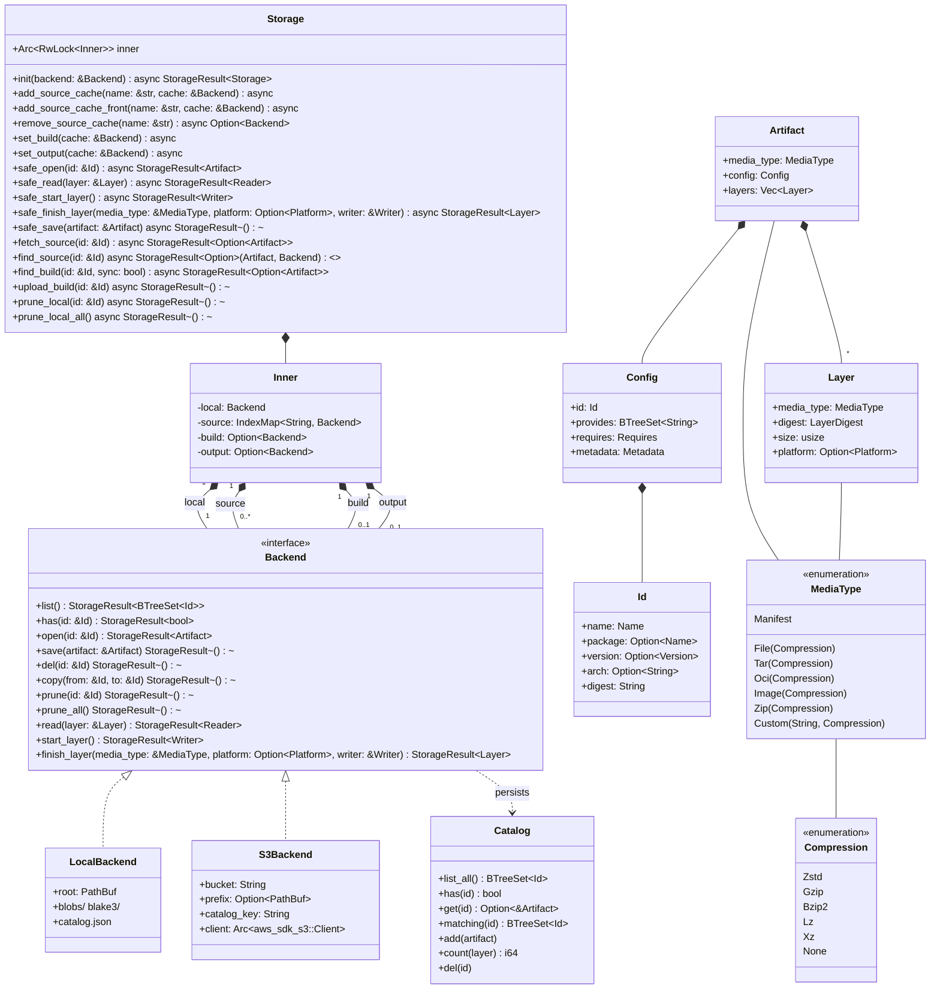

# Edo Storage Component - Detailed Design

## 1. Overview

The Storage component is one of Edo's four core architectural pillars (alongside Source, Environment, and Transform), responsible for managing the caching and persistence of all artifacts in the build system. It provides a unified interface for storing, retrieving, and managing artifacts regardless of the underlying storage mechanism.

Storage is owned by the `Context` (see `crates/edo-core/src/context/mod.rs`) and consumed by the `Scheduler` during DAG execution (see `crates/edo-core/src/scheduler/`). The `Scheduler` itself never constructs storage; it operates against the composite `Storage` handle that `Context::create` wires up from the user's `edo.toml`.

## 2. Core Responsibilities

The Storage component is responsible for:

1. **Artifact Storage**: Persisting artifacts in a content-addressable manner
2. **Artifact Retrieval**: Retrieving artifacts by their unique identifiers
3. **Cache Management**: Handling both local and remote artifact caches, split into four roles (local / source / build / output)
4. **Artifact Organization**: Maintaining a structured representation of artifacts via the per-backend `Catalog`
5. **Integrity Verification**: Validating artifact integrity through Blake3 digests on layer content
6. **Storage Backend Abstraction**: Providing a consistent interface across different storage backends, including wasm plugin backends

## 3. Component Architecture

### 3.1 Key Abstractions

#### 3.1.1 Artifact

An Artifact represents a single unit of data within the build system, implemented in `crates/edo-core/src/storage/artifact.rs` as:

```rust
#[derive(Serialize, Deserialize, Debug, Clone, Builder)]
#[builder(setter(into))]
pub struct Artifact {
    #[builder(setter(into), default)]
    media_type: MediaType,
    config: Config,
    #[builder(setter(into), default)]
    layers: Vec<Layer>,
}

#[derive(Serialize, Deserialize, Clone, Debug, Builder)]
#[builder(setter(into))]
pub struct Config {
    id: Id,
    #[builder(setter(into), default)]
    provides: BTreeSet<String>,
    #[builder(setter(into), default)]
    requires: Requires,
    #[builder(setter(into), default)]
    metadata: Metadata,
}

#[derive(Serialize, Deserialize, Debug, Clone, Builder)]
#[builder(setter(into))]
pub struct Layer {
    media_type: MediaType,
    digest: LayerDigest,
    size: usize,
    #[builder(setter(into), default)]
    platform: Option<Platform>,
}
```

> Naming note: the Rust type is literally named `Config` inside the `storage` module. The knowledge-base summary and the WIT contract both refer to it as `ArtifactConfig` / `artifact-config` to disambiguate it from the user-configuration `Config` elsewhere in `edo-core`. They are the same concept.

Key characteristics:

- **Unique Identifier (`Id`)**: name + optional package + optional version + optional architecture + required Blake3 digest.
- **OCI Compatibility**: Structured as an OCI-compatible artifact manifest.
- **Config** contains:
  - `id`: the unique identifier
  - `provides`: capability strings advertised by this artifact
  - `requires`: dependencies on other artifacts with version requirements (`BTreeMap<String, BTreeMap<String, VersionReq>>`)
  - `metadata`: free-form `serde_json::Value` metadata
- **Layer Structure**: zero or more content layers, each with a media type, digest, size, and optional OCI `Platform`.
- **Media Types**: `Manifest`, `File`, `Tar`, `Oci`, `Image`, `Zip`, `Custom(String, _)`.
- **Compression**: `None`, `Zstd`, `Gzip`, `Bzip2`, `Lz`, `Xz` on layer content.
- **Platform**: optional OCI `Platform` (re-exported from the `ocilot` crate).

##### Media Type System

Edo implements a rich media type system for artifact content:

```rust
/// Denotes the use of any compression algorithm on a layer
#[derive(Debug, PartialEq, Eq, Clone, Serialize, Deserialize)]
pub enum Compression {
    #[serde(rename = ".zst")]
    Zstd,
    #[serde(rename = ".gz", alias = ".gzip", alias = ".gzip2")]
    Gzip,
    #[serde(rename = ".bz2", alias = ".bzip2", alias = ".bzip")]
    Bzip2,
    #[serde(rename = ".lz4", alias = ".lzma")]
    Lz,
    #[serde(rename = ".xz")]
    Xz,
    #[serde(other, rename = "")]
    None,
}

/// Denotes the content of a layer
#[derive(Clone, Debug, PartialEq, Eq, Default)]
pub enum MediaType {
    #[default]
    Manifest,
    File(Compression),
    Tar(Compression),
    Oci(Compression),
    Image(Compression),
    Zip(Compression),
    Custom(String, Compression),
}
```

The media type system supports:

1. **Standard Types**: Pre-defined media types for common content:
   - `Manifest`: Artifact manifests (uncompressed)
   - `File`: Individual files (with optional compression)
   - `Tar`: Tar archives (with optional compression) — consumed by `edo checkout`
   - `Oci`: OCI container images (with optional compression)
   - `Image`: Generic images (with optional compression)
   - `Zip`: Zip archives (with optional compression)
2. **Custom Types**: User-defined media types with optional compression.
3. **Compression Detection**: `Compression::detect` uses regexes over the trailing extension.
4. **String Representation**: `vnd.edo.artifact.<schema-version>.<type>[.<compression>]` (currently `v1`), e.g.:
   - `vnd.edo.artifact.v1.manifest`
   - `vnd.edo.artifact.v1.tar.gz`
   - `vnd.edo.artifact.v1.custom-type.zst`

#### 3.1.2 Artifact ID

The `Id` structure represents a unique identifier for artifacts. Defined in `crates/edo-core/src/storage/id.rs`:

```rust
/// Represents the unique id for an artifact, it optionally can contain a
/// secondary name called the package name, along with an optional version.
/// All ids contain a blake3 digest
#[derive(Hash, PartialEq, Eq, PartialOrd, Ord, Clone, Debug, Builder)]
pub struct Id {
    name: Name,               // required artifact name (sanitised of @ : . - /)
    package: Option<Name>,    // optional package name (same sanitisation)
    version: Option<Version>, // optional semver
    arch: Option<String>,     // optional architecture
    digest: String,           // required Blake3 digest
}
```

Key characteristics:

- **Name**: Sanitised string — `@`, `:`, `.`, `-`, `/` are replaced with `_`, and `http://` / `https://` prefixes are stripped.
- **Package** (optional): Secondary identifier for grouping related artifacts.
- **Version** (optional): `semver::Version`.
- **Architecture** (optional): Target architecture identifier.
- **Digest**: Blake3 hash for content addressing.

String representation (see `Id::prefix` + `Display`):

- Basic: `name-digest`
- With package: `package+name-digest`
- With version: `name-version-digest`
- With architecture: `name.arch-digest`
- Full: `package+name-version.arch-digest`

#### 3.1.3 Catalog

Each `Backend` maintains an on-disk `Catalog` (`crates/edo-core/src/storage/catalog.rs`) that tracks `provides`/`requires` across all stored artifacts and serves as the lookup index for `list` / `has` / `open` / `prune`. The `LocalBackend` persists it as `catalog.json` at the cache root; the `S3Backend` persists it under `<prefix>/catalog.json` in the bucket.

#### 3.1.4 Storage Composite

The main `Storage` handle manages multiple backends in distinct roles (see `crates/edo-core/src/storage/mod.rs::Inner`):

| Slot     | Type                        | Role                                                                            |
| -------- | --------------------------- | ------------------------------------------------------------------------------- |
| `local`  | `Backend` (required)        | On-disk cache used by transforms locally. All cross-cache sync terminates here. |
| `source` | `IndexMap<String, Backend>` | Priority-ordered set of caches for fetching remote source artifacts.            |
| `build`  | `Option<Backend>`           | Optional cache for reusing pre-built transform artifacts.                       |
| `output` | `Option<Backend>`           | Optional publish-only cache for transform results.                              |

#### 3.1.5 Backend

A `Backend` is an `arc_handle`-wrapped trait abstraction for the actual storage mechanism. Today the following backend kinds exist:

| Backend        | Source                                           | How it is selected                                                                  |
| -------------- | ------------------------------------------------ | ----------------------------------------------------------------------------------- |
| `LocalBackend` | `crates/edo-core/src/storage/local.rs`           | Always used for the local cache; auto-registered by the CLI at `//edo-local-cache`. |
| `S3Backend`    | `crates/plugins/edo-core-plugin/src/storage/s3/` | Selected via `kind = "s3"` in a `[cache.*]` TOML table.                             |

Anything else would have to be provided by a **wasm plugin** (`crates/edo-core/src/plugin/impl_/backend.rs` adapts `storage-backend` guest resources onto the `Backend` trait).

### 3.2 Component Structure



## 4. Key Interfaces

### 4.1 Storage Interface

```rust
/// Main Storage component that manages multiple cache backends
#[derive(Clone)]
pub struct Storage {
    inner: Arc<RwLock<Inner>>,
}

impl Storage {
    pub async fn init(backend: &Backend) -> StorageResult<Self>;

    pub async fn add_source_cache(&self, name: &str, cache: &Backend);
    pub async fn add_source_cache_front(&self, name: &str, cache: &Backend);
    pub async fn remove_source_cache(&self, name: &str) -> Option<Backend>;
    pub async fn set_build(&self, cache: &Backend);
    pub async fn set_output(&self, cache: &Backend);

    /// **safe**: local-only, no network.
    pub async fn safe_open(&self, id: &Id) -> StorageResult<Artifact>;
    pub async fn safe_read(&self, layer: &Layer) -> StorageResult<Reader>;
    pub async fn safe_start_layer(&self) -> StorageResult<Writer>;
    pub async fn safe_finish_layer(
        &self,
        media_type: &MediaType,
        platform: Option<Platform>,
        writer: &Writer,
    ) -> StorageResult<Layer>;
    pub async fn safe_save(&self, artifact: &Artifact) -> StorageResult<()>;

    /// **unsafe**: may hit a network-backed source cache.
    pub async fn fetch_source(&self, id: &Id) -> StorageResult<Option<Artifact>>;
    pub async fn find_source(&self, id: &Id) -> StorageResult<Option<(Artifact, Backend)>>;

    /// **unsafe**: may hit the network-backed build cache.
    pub async fn find_build(&self, id: &Id, sync: bool) -> StorageResult<Option<Artifact>>;
    pub async fn upload_build(&self, id: &Id) -> StorageResult<()>;

    pub async fn prune_local(&self, id: &Id) -> StorageResult<()>;
    pub async fn prune_local_all(&self) -> StorageResult<()>;
}
```

`Storage::upload_output` also exists internally on `Inner` but is currently marked `#[allow(dead_code)]` — the output cache is wired and persisted, but the public publish path is not yet surfaced on `Storage` itself. **Planned / not yet implemented**: a public `upload_output` on `Storage`.

### 4.2 Backend Interface

```rust
/// Interface for storage backend implementations.
/// Declared with #[arc_handle], so implementors write `impl BackendImpl`
/// and callers pass the cheap-to-clone `Backend` handle.
#[arc_handle]
#[async_trait]
pub trait Backend {
    async fn list(&self) -> StorageResult<BTreeSet<Id>>;
    async fn has(&self, id: &Id) -> StorageResult<bool>;
    async fn open(&self, id: &Id) -> StorageResult<Artifact>;
    async fn save(&self, artifact: &Artifact) -> StorageResult<()>;
    async fn del(&self, id: &Id) -> StorageResult<()>;
    async fn copy(&self, from: &Id, to: &Id) -> StorageResult<()>;
    async fn prune(&self, id: &Id) -> StorageResult<()>;
    async fn prune_all(&self) -> StorageResult<()>;
    async fn read(&self, layer: &Layer) -> StorageResult<Reader>;
    async fn start_layer(&self) -> StorageResult<Writer>;
    async fn finish_layer(
        &self,
        media_type: &MediaType,
        platform: Option<Platform>,
        writer: &Writer,
    ) -> StorageResult<Layer>;
}
```

### 4.3 WebAssembly Plugin Interface (WIT)

The storage surface crosses the wasm boundary through a set of resources defined in `crates/edo-wit/host.wit` (interface `host`). Guest plugins consume it via `wit-bindgen`; the host binds it via `wasmtime::component::bindgen!`. The contract is not a standalone `edo:storage` package — it is part of the single `edo:host` world.

Relevant excerpts from `host.wit`:

```wit
resource id {
    constructor(name: string, digest: string,
                version: option<string>, pkg: option<string>, arch: option<string>);
    name: func() -> string;
    digest: func() -> string;
    set-digest: func(digest: string);
    version: func() -> option<string>;
    set-version: func(input: string);
    clear-version: func();
    pkg: func() -> option<string>;
    arch: func() -> option<string>;
    from-string: static func(input: string) -> id;
}

resource layer {
    media-type: func() -> string;
    digest: func() -> string;
    size: func() -> u64;
    platform: func() -> option<string>;
}

resource artifact-config {
    constructor(id: borrow<id>, provides: list<string>, metadata: option<string>);
    id: func() -> id;
    provides: func() -> list<string>;
    requires: func() -> list<tuple<string, list<tuple<string, string>>>>;
    add-requirement: func(group: string, name: string, version: string);
}

resource artifact {
    constructor(config: borrow<artifact-config>);
    config: func() -> artifact-config;
    layers: func() -> list<layer>;
    add-layer: func(layer: borrow<layer>);
}

resource storage {
    open: func(id: borrow<id>) -> result<artifact, error>;
    read: func(layer: borrow<layer>) -> result<reader, error>;
    start-layer: func() -> result<writer, error>;
    finish-layer: func(media-type: string, platform: option<string>,
                       writer: borrow<writer>) -> result<layer, error>;
    save: func(artifact: borrow<artifact>) -> result<_, error>;
}
```

Things to note about the WIT surface vs the native `Backend` trait:

- Guests see a single `storage` resource (the composite), not per-backend `Backend` methods. The host adapts calls into the active composite.
- Guest-authored **backends** are registered by implementing the `storage-backend` component variant listed in the `component` enum and exporting the guest-side bindings from `edo-plugin-sdk` (see `crates/edo-core/src/plugin/impl_/backend.rs` for the host-side adapter).
- `media-type` crosses the boundary as a `string` and is parsed back into `MediaType` host-side.
- `platform` crosses as an optional string and is converted through `ocilot::models::Platform`.

## 5. Configuration (TOML)

Storage backends are declared in the project's `edo.toml` under the `[cache.*]` tables. Only `kind` is dispatched by the plugin registry; remaining keys are backend-specific.

```toml
schema-version = "1"

# Priority-ordered source caches (map under [cache.source.<name>])
[cache.source.public]
kind   = "s3"
bucket = "my-public-artifacts"
prefix = "edo/cache"

# Optional build cache (singular [cache.build])
[cache.build]
kind   = "s3"
bucket = "my-build-cache"

# Optional output cache (singular [cache.output])
[cache.output]
kind   = "s3"
bucket = "my-publish-bucket"
prefix = "releases"
```

The schema loader lives at `crates/edo-core/src/context/schema.rs`:

- `Cache.source: BTreeMap<String, toml::Value>` → each `[cache.source.<name>]` becomes a `Node` with id `backend` and the given `<name>`.
- `Cache.build: Option<toml::Value>` → a single `[cache.build]` node.
- `Cache.output: Option<toml::Value>` → a single `[cache.output]` node.

The CLI (`crates/edo/src/cmd/mod.rs::create_context`) converts these nodes into `Backend` handles and wires them onto the `Storage` composite at the reserved addresses below.

**Supported builtin cache `kind`s:** `s3`.
Anything else must be supplied by a wasm plugin that declares a `storage-backend` component.

## 6. Reserved Addresses

Storage slots use a fixed set of `Addr` identifiers in the registry (see `crates/edo-core/src/context/mod.rs` and the comments in `crates/edo-core/src/storage/mod.rs`):

| Address                     | Role                                                                                                                                   |
| --------------------------- | -------------------------------------------------------------------------------------------------------------------------------------- |
| `//edo-local-cache`         | The required local cache. Auto-registered by the CLI (defaults to `.edo/` under the project root unless overridden by `-s/--storage`). |
| `//edo-source-cache/<name>` | A named source cache. One per `[cache.source.<name>]` table.                                                                           |
| `//edo-build-cache`         | The optional build cache. Created from `[cache.build]`.                                                                                |
| `//edo-output-cache`        | The optional output cache. Created from `[cache.output]`.                                                                              |

## 7. Storage Backend Implementations

### 7.1 LocalBackend

The default storage backend uses the local filesystem. Layout:

```
${EDO_LOCAL_CACHE}/
├── blobs/
│   └── blake3/
│       ├── <digest1>
│       ├── <digest2>
│       └── ...
└── catalog.json
```

Where:

- `blobs/blake3/` contains content-addressed layer blobs, named by their Blake3 digest.
- `catalog.json` is the persisted `Catalog` mapping `Id`s to their `Artifact` manifests.

Implementation details:

- Content deduplication through blob storage (layers shared across artifacts are stored once).
- Atomic write via temp-file-then-rename to prevent corruption.
- Blake3 verification on finish-layer.
- Always used at `//edo-local-cache`; the on-disk root is configurable via the CLI `-s/--storage` flag.

### 7.2 S3Backend

Defined in `crates/plugins/edo-core-plugin/src/storage/s3/`. An OCI-layer-aware, AWS-SDK-backed cache:

- Config keys: `bucket` (required), `prefix` (optional).
- Credentials resolve through `aws_config::load_defaults(BehaviorVersion::latest())` — i.e. the standard AWS credential chain.
- Layers are uploaded via multipart upload in 10 MiB chunks.
- `catalog.json` lives at `<prefix>/catalog.json` (or the bucket root when no prefix) and is mutated under a best-effort `.lock` key with a 5-second stale-lock timeout.

### 7.3 Other Remote Backends

Not built in today. A wasm plugin can register additional `kind`s by exporting a `storage-backend` component (via `edo-plugin-sdk`). An HTTP-only pull-through cache, a registry-style cache, etc. would all live there rather than in core.

## 8. Artifact Cache Management

### 8.1 Cache Structure

Edo's artifact cache system operates with four specialized cache roles:

1. **Local Cache**: Required for all operations; stores artifacts needed during build.
2. **Source Caches**: Priority-ordered caches for fetching remote artifacts (`IndexMap` preserves insertion/priority order).
3. **Build Cache**: Optional cache for reusing pre-built transform artifacts.
4. **Output Cache**: Optional publish-only cache for transform results.

This multi-cache architecture optimises for:

- **Lookup Speed**: Quick determination if an artifact exists locally before reaching out.
- **Storage Efficiency**: Deduplication of content through content-addressing.
- **Integrity**: Blake3 validation of layer contents.
- **Network Efficiency**: Minimising network operations during builds.

### 8.2 Cache Synchronization

Artifacts are synchronised between caches through two private primitives on `Inner`:

#### 8.2.1 Download

`download(artifact, backend)` copies an artifact from a remote cache to the local cache:

```rust
async fn download(&self, artifact: &Artifact, backend: &Backend) -> StorageResult<()> {
    let mut handles = Vec::new();
    for layer in artifact.layers() {
        let backend = backend.clone();
        let local = self.local.clone();
        let layer = layer.clone();
        handles.push(tokio::spawn(async move {
            let mut reader = backend.read(&layer).await?;
            let mut writer = local.start_layer().await?;
            tokio::io::copy(&mut reader, &mut writer).await.context(error::IoSnafu)?;
            local.finish_layer(layer.media_type(), layer.platform().clone(), &writer).await?;
            Ok(())
        }));
    }
    wait(handles).await?;
    self.local.save(artifact).await?;
    Ok(())
}
```

#### 8.2.2 Upload

`upload(artifact, backend)` copies an artifact from the local cache to a remote cache (symmetric to `download`). It is used by `upload_build` and `upload_output`.

### 8.3 Cache Operations

The storage component exposes these operation categories:

1. **Safe Operations** (local-only, no network):
   - `safe_open` — open an artifact from local cache
   - `safe_read` — read a layer from local cache
   - `safe_start_layer` / `safe_finish_layer` — build a new layer locally
   - `safe_save` — save an artifact manifest locally
2. **Source Operations** (may reach source caches):
   - `fetch_source` — find in source caches and synchronise to local if found
   - `find_source` — locate in source caches without synchronising (returns the owning `Backend` too)
3. **Build Operations** (may reach the build cache):
   - `find_build(id, sync)` — find in the build cache; `sync = true` also downloads into local
   - `upload_build` — upload a local artifact to the build cache (no-op if none registered)
4. **Output Operations** (publish-only):
   - Internal `upload_output` exists on `Inner` but is not yet re-exposed on `Storage`. **Planned / not yet implemented.**

### 8.4 Cache Invalidation

Cache invalidation is user-driven:

1. **Prune Command** (`edo prune`) → `prune_local` / `prune_local_all`:
   - `prune_local(id)` — remove artifacts that share `id.prefix()` but have a different digest.
   - `prune_local_all()` — prune all duplicate artifacts across the local cache.
2. **Cache Membership**:
   - `add_source_cache` / `add_source_cache_front` — insert a source cache (tail / head of priority list).
   - `remove_source_cache` — remove a named source cache.
   - `set_build` / `set_output` — (re)assign the build/output slots.

## 9. OCI Artifact Structure

Edo stores artifacts in an OCI-compatible format. Illustrative manifest shape:

```json
{
  "id": {
    "name": "example-artifact",
    "digest": "blake3:ab3484..."
  },
  "manifest": {
    "schemaVersion": 2,
    "mediaType": "vnd.edo.artifact.v1.manifest",
    "config": {
      "mediaType": "vnd.edo.artifact.v1.manifest",
      "digest": "blake3:fe4521...",
      "size": 1024
    },
    "layers": [
      {
        "mediaType": "vnd.edo.artifact.v1.tar.gz",
        "digest": "blake3:c29a12...",
        "size": 10240
      }
    ],
    "annotations": {
      "edo.origin": "source:git",
      "edo.created": "2023-04-15T12:00:00Z"
    }
  }
}
```

Note that Edo uses its own `vnd.edo.artifact.v1.*` media-type scheme (see §3.1.1); the JSON above is illustrative — the on-disk representation is backend-specific.

## 10. Error Handling

The Storage component uses Snafu-based errors through the `StorageResult` alias:

```rust
pub type StorageResult<T> = Result<T, StorageError>;

#[derive(Debug, Snafu)]
#[snafu(visibility(pub(crate)))]
pub enum StorageError {
    Join { source: JoinError },
    Child { children: Vec<StorageError> },
    Io { source: std::io::Error },
    NotFound { id: Id },
    LayerNotFound { digest: String },
    InvalidArtifact { details: String },
    PathAccess { path: PathBuf, details: String },
    BackendFailure { details: String },
    // ... additional variants (regex, catalog I/O, schema, etc.) in
    // crates/edo-core/src/storage/error.rs and the local backend's nested error module
}
```

Parallel synchronisation uses a helper `wait()` that collects `JoinError`s into a `Child { children }` aggregate so a single layer-copy failure does not drop the others' errors.

`StorageError` is `#[snafu(transparent)]`-wrapped by higher-level errors (e.g. `TransformError`), so most call sites can bubble with `?`.

## 11. Implementation Considerations

### 11.1 Performance Optimizations

- **Parallel Layer Copies**: `download`/`upload` spawn one `tokio::task` per layer and `try_join_all` them.
- **Lazy Loading**: Artifacts open their manifest; layer content is streamed on demand through `Reader`/`Writer` (`crates/edo-core/src/util/`).
- **Partial Retrieval**: Layers are independent blobs, so individual layers can be read without materialising the whole artifact.
- **Catalog Indexing**: In-memory catalog maps `Id → Artifact` for O(log n) lookups.

### 11.2 Concurrency

- **Thread-safe Handle**: `Storage` is a cheap-to-clone `Arc<RwLock<Inner>>`.
- **Lock Granularity**: Read-heavy paths (`safe_open`, `safe_read`, `find_*`) take the read lock; membership changes and layer-finalisation take the write lock.
- **Atomic Writes**: Local blobs and `catalog.json` are written via temp-file-then-rename to avoid torn state.

### 11.3 Resilience

- **Failure Aggregation**: `wait()` collects all per-task failures into `StorageError::Child { children }`.
- **S3 Lock Timeout**: The S3 catalog lock is best-effort with a 5 s stale-lock timeout before surfacing a diagnostic.
- **Content Verification**: Blake3 digests are recomputed when a layer is finished.

## 12. Testing Strategy

Storage testing focuses on:

1. **Unit Tests**: Catalog operations, media-type round-trips, `Id` parsing, Blake3 accounting.
2. **Integration Tests**: `Storage` composite behaviour against a temp `LocalBackend`.
3. **Backend Tests**: S3 backend exercised against a local MinIO / mocked S3.
4. **Performance Tests**: Benchmark parallel layer copies.
5. **Fuzz Tests**: Resilience against corrupted manifests and truncated blobs.

## 13. Future Enhancements (aspirational — not implemented)

1. **Public `upload_output`** on `Storage` — wire `Inner::upload_output` to a public method so the CLI can publish transform results.
2. **Additional builtin backends** — e.g. HTTP pull-through, registry-backed. Currently expected to live in wasm plugins rather than `edo-core-plugin`.
3. **Distributed Cache**: multi-node artifact caching.
4. **Tiered Storage**: hierarchical storage management.
5. **Pluggable Compression Algorithms** beyond the current fixed `Compression` enum.
6. **Advanced Deduplication**: sub-artifact / chunked deduplication.
7. **Encryption at rest**: per-layer encryption of cached blobs.
