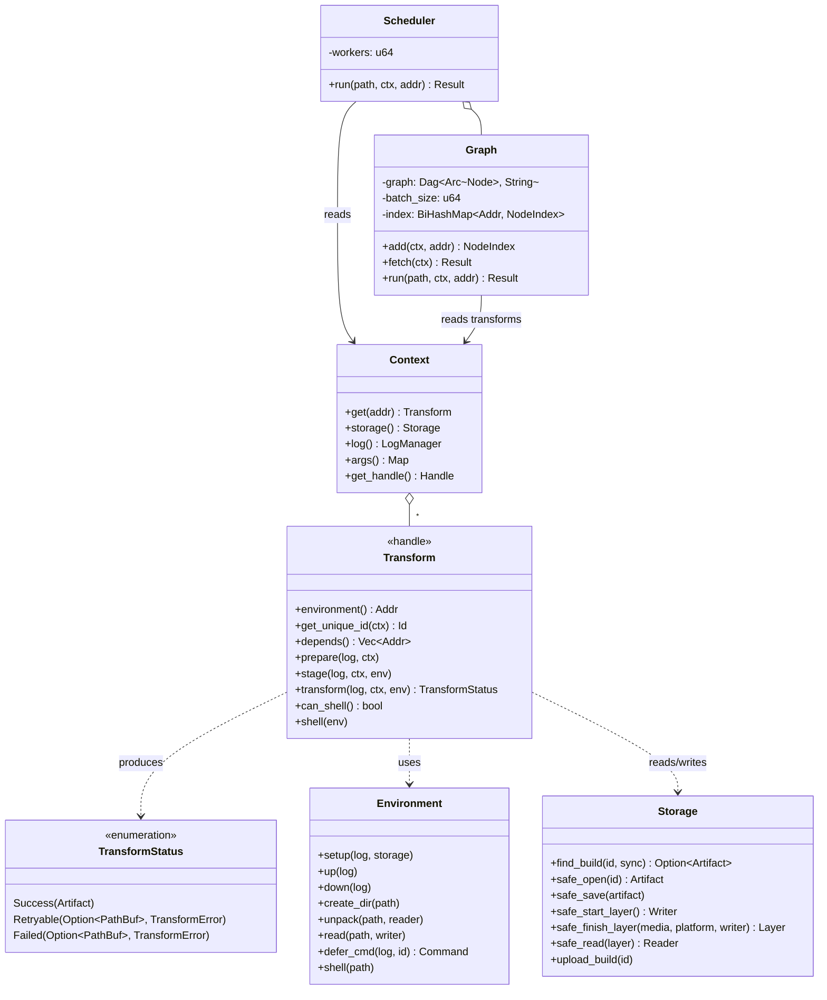

# Edo Transform Component - Detailed Design

## 1. Overview

The Transform component is the fourth and final core architectural pillar of Edo, responsible for converting input artifacts into output artifacts. It represents the actual build operations that process sources and dependent artifacts to produce built outputs. Transforms work with the **Storage**, **Source**, and **Environment** components — orchestrated by the `Context` (registry and configuration) and the `Scheduler` (DAG execution) — to provide a flexible and reproducible build pipeline.

Transforms are declared in `edo.toml` under `[transform.<name>]` tables and dispatched by kind (`script`, `import`, `compose`) to the builtin core plugin.

## 2. Core Responsibilities

The Transform component is responsible for:

1. **Artifact Transformation**: Converting input artifacts into output artifacts.
2. **Dependency Management**: Declaring the other transforms this transform depends on.
3. **Build Execution**: Running build commands inside an environment produced by an environment farm.
4. **Incremental Building**: Short-circuiting work via Merkle-hashed unique IDs and build-cache lookups.
5. **Build Caching**: Surfacing already-built artifacts from `//edo-build-cache` / local storage.
6. **Error Handling**: Signalling success, retryable failure, or permanent failure, with optional debug shell access.

## 3. Component Architecture

### 3.1 Key Abstractions

#### 3.1.1 Transform

`Transform` is declared with the `#[arc_handle]` macro in `crates/edo-core/src/transform/mod.rs`, so callers interact with a cheap-to-clone `Transform` handle that wraps an `Arc<dyn TransformImpl>`. Plugin authors implement `TransformImpl`; `Transform::new(impl)` produces the handle stored in the `Context` registry.

```rust
#[arc_handle]
#[async_trait]
pub trait Transform {
    /// Returns the address of the environment farm to use.
    async fn environment(&self) -> TransformResult<Addr>;

    /// Return the transform's unique id that will represent its output.
    async fn get_unique_id(&self, ctx: &Handle) -> TransformResult<Id>;

    /// Returns all transforms this one depends on.
    async fn depends(&self) -> TransformResult<Vec<Addr>>;

    /// Fetch sources and dependent artifacts before the environment exists.
    async fn prepare(&self, log: &Log, ctx: &Handle) -> TransformResult<()>;

    /// Stage files into the environment once it is up.
    async fn stage(&self, log: &Log, ctx: &Handle, env: &Environment) -> TransformResult<()>;

    /// Perform the transformation. Returns a status rather than a Result.
    async fn transform(&self, log: &Log, ctx: &Handle, env: &Environment) -> TransformStatus;

    /// May a user enter a shell if this transform fails?
    fn can_shell(&self) -> bool;

    /// Open a shell in the environment at the appropriate working directory.
    fn shell(&self, env: &Environment) -> TransformResult<()>;
}
```

Key capabilities:

- **Environment Selection**: `environment()` returns the `Addr` of an environment farm (e.g. `//default` or `//project/gcc`).
- **Identity**: `get_unique_id()` yields a Blake3-derived `Id` combining dependency IDs, source IDs, script content, and optional architecture — used to address the output artifact and to look it up in the build cache.
- **Dependencies**: `depends()` lists the `Addr`s that must finish first; the `Scheduler` uses this to build the DAG.
- **Lifecycle Split**: `prepare` runs outside the environment; `stage` runs after the environment is `up`; `transform` performs the actual build; `shell` is optional post-mortem.

#### 3.1.2 TransformStatus

`transform()` returns a status (not a `Result`) so that retryable and permanent failures can be distinguished without losing the log path used for debugging:

```rust
pub enum TransformStatus {
    Success(Artifact),
    Retryable(Option<PathBuf>, TransformError),
    Failed(Option<PathBuf>, TransformError),
}
```

- **Success**: Contains the produced `Artifact` (already saved to storage).
- **Retryable**: Temporary failure — the scheduler may re-attempt. The `PathBuf` is usually the log file path.
- **Failed**: Permanent failure. The `PathBuf` is usually the log file path.

#### 3.1.3 `transform_err!` macro

Because `transform()` returns `TransformStatus` (not a `Result`), the `?` operator cannot be used directly. The `transform_err!` macro (exported from `edo_core::transform`) converts a `Result::Err` into `TransformStatus::Failed` and logs the error:

```rust
async fn transform(&self, log: &Log, ctx: &Handle, env: &Environment) -> TransformStatus {
    let id = transform_err!(self.get_unique_id(ctx).await);
    let writer = transform_err!(ctx.storage().safe_start_layer().await);
    // ...
    TransformStatus::Success(artifact)
}
```

Many builtin transforms alternatively wrap the body in an `async move { ... Ok::<_, TransformError>(artifact) }.await` block and map the outer `Result` onto `TransformStatus::Success` / `TransformStatus::Retryable` once at the bottom; either pattern is idiomatic.

#### 3.1.4 `Handle` (transform-side Context view)

A `Handle` is the cloneable read-only view of the `Context` given to transforms. It exposes:

- `ctx.storage()` — the `Storage` handle (layers, artifact save/open, build-cache lookups).
- `ctx.log()` — log factory.
- `ctx.get(addr)` — fetch another registered `Transform` by `Addr` (used when hashing dependency IDs).
- `ctx.args()` — CLI-supplied arguments (e.g. `arch`).

Unlike the aspirational "TransformManager / TransformRegistry / TransformHandle" split in older drafts of this document, there is no dedicated transform-manager type: the `Context` owns the transform registry and the `Scheduler` owns the execution graph.

### 3.2 Component Structure



## 4. Key Interfaces

### 4.1 Transform Trait (canonical signature)

```rust
// crates/edo-core/src/transform/mod.rs
#[arc_handle]
#[async_trait]
pub trait Transform {
    async fn environment(&self) -> TransformResult<Addr>;
    async fn get_unique_id(&self, ctx: &Handle) -> TransformResult<Id>;
    async fn depends(&self) -> TransformResult<Vec<Addr>>;
    async fn prepare(&self, log: &Log, ctx: &Handle) -> TransformResult<()>;
    async fn stage(&self, log: &Log, ctx: &Handle, env: &Environment) -> TransformResult<()>;
    async fn transform(&self, log: &Log, ctx: &Handle, env: &Environment) -> TransformStatus;
    fn can_shell(&self) -> bool;
    fn shell(&self, env: &Environment) -> TransformResult<()>;
}
```

Lifecycle, as driven by the scheduler:

1. **Graph Construction** — `Graph::add` walks `depends()` recursively, populating nodes and edges.
2. **Fetch Phase** — `Graph::fetch` calls `prepare()` in parallel for every node whose `get_unique_id` is not already present in the build cache.
3. **Execution Phase** — `Graph::run` dispatches leaves first, then descendants once their parents complete, respecting the scheduler worker budget:
   - Compute `get_unique_id`; short-circuit on build-cache hit.
   - Acquire the environment via `environment()` → `EnvironmentManager::create` → `Environment::setup` / `up`.
   - Run `stage()`.
   - Run `transform()` and dispatch on `TransformStatus`.
   - On failure, if `can_shell()` and a log/debug path was returned, open `shell()`.
   - Always `Environment::down` before finishing the node.

### 4.2 Declaring Transforms in `edo.toml`

Transforms are declared as TOML tables keyed by kind. The `schema-version = "1"` header is required at the top of the file. Each `[transform.<name>]` entry becomes an `Addr` of the form `//<project>/<name>` in the registry.

```toml
schema-version = "1"

[source.src]
kind       = "local"
path       = "hello_rust"
out        = "."
is_archive = false

# Pull sources into an artifact (no scripting).
[transform.code]
kind   = "import"
source = ["//hello_rust/src"]

# Run shell commands against staged inputs.
[transform.vendor]
kind     = "script"
depends  = ["//hello_rust/code"]
commands = [
    "mkdir -p {{install-root}}/.cargo",
    "cargo vendor > vendor.toml",
    "cp -rf {{build-root}}/vendor {{install-root}}/vendor",
    "cp vendor.toml {{install-root}}/.cargo/config.toml",
]

[transform.build]
kind     = "script"
depends  = ["//hello_rust/code", "//hello_rust/vendor"]
commands = [
    "mkdir -p {{install-root}}/bin",
    "cargo build --offline --release",
    "cp target/release/hello_rust {{install-root}}/bin/hello_rust",
]
```

A transform in a different environment farm references it by `Addr`:

```toml
[transform.build]
kind        = "script"
environment = "//hello_oci/gcc"   # defaults to //default if omitted
source      = ["//hello_oci/code"]
commands    = [
    "mkdir -p {{install-root}}/bin",
    "gcc -o hello_oci hello.c",
    "cp hello_oci {{install-root}}/bin/hello_oci",
]
```

Optional scheduler tuning lives in a separate top-level table:

```toml
[scheduler]
workers = 8   # default; controls Graph batch_size / parallel transform fan-out
```

### 4.3 Builtin Transform Kinds

Dispatched by `CorePlugin::supports` in `crates/plugins/edo-core-plugin/src/lib.rs`.

| Kind      | Source file                                     | Purpose                                                                        |
| --------- | ----------------------------------------------- | ------------------------------------------------------------------------------ |
| `script`  | `.../transform/script.rs` (`ScriptTransform`)   | Run Handlebars-templated shell commands inside an environment farm.            |
| `import`  | `.../transform/import.rs` (`ImportTransform`)   | Materialise `[source.*]` inputs as a single artifact (no commands, no env).    |
| `compose` | `.../transform/compose.rs` (`ComposeTransform`) | Merge the layers/artifacts of several upstream transforms into a new artifact. |

#### 4.3.1 `script`

`ScriptTransform` fields (parsed in `from_node`):

- `environment` (`Addr`, default `//default`) — farm that produces the build environment.
- `interpreter` (string, default `"bash"`) — passed to `env.defer_cmd(...).set_interpreter(...)`.
- `commands` (list of strings, required) — run sequentially via `Command::run` after Handlebars templating.
- `depends` (list of `Addr`s) — upstream transforms; their artifacts are unpacked into `build-root` during `stage`.
- `source` / `sources` — `[source.*]` entries staged into `build-root`.
- `artifact` (optional path) — subdirectory of `install-root` to capture as the output layer (defaults to the whole `install-root`).
- `arch` (optional, or via CLI `--arch`) — forwarded into the artifact `Id` and into the `arch` template variable.

Handlebars variables available to every command string:

- `{{build-root}}` — per-transform build directory staged with sources and dependency artifacts.
- `{{install-root}}` — clean output directory; its contents become the resulting artifact layer.
- `{{arch}}` — target architecture (`arch` arg or the `arch` field, else `std::env::consts::ARCH`).
- Every other key/value pair passed via `--arg key=value` is also set as a template variable.

Identity: `get_unique_id` is the Blake3 Merkle hash of (sorted dependency IDs) ∥ (source IDs) ∥ (joined command text), with the transform `Addr` as the `Id` name and the optional `arch` attached.

Output: everything inside `install-root` (or the `artifact` subpath) is written as a `Tar(Compression::None)` layer on a `MediaType::Manifest` artifact, tagged with an OCI `Platform { os, architecture }`.

Failure mode: script transforms always return `TransformStatus::Retryable(Some(log_path), …)` on error. `can_shell()` is `true` and `shell()` opens a shell at `build-root`.

#### 4.3.2 `import`

`ImportTransform` has only `sources` (map of name → `Source`). `environment()` returns `//default`, `depends()` is empty, `get_unique_id` is a Blake3 hash of the source IDs, and `transform` stages each source into a layer and wraps it as an artifact. Use it as a leaf that turns `[source.*]` entries into addressable artifacts for downstream `script` / `compose` transforms.

#### 4.3.3 `compose`

`ComposeTransform` has `depends` (list of `Addr`s) and optional `arch`. `environment()` returns `//default` and no commands are run; it hashes the dependency IDs, then concatenates their layers into a single artifact. Use it to stitch together per-component builds into a release payload.


## 5. Implementation Details

### 5.1 Scheduler Graph

The scheduler lives in `crates/edo-core/src/scheduler/` and uses the `daggy` crate. The `Scheduler` holds a `workers: u64` (from `[scheduler] workers = N`, default `8`) and constructs a `Graph` per run:

```rust
#[derive(Clone)]
pub struct Graph {
    graph: Dag<Arc<Node>, String>,
    batch_size: u64,
    index: BiHashMap<Addr, NodeIndex>,
}

impl Graph {
    pub fn new(batch_size: u64) -> Self { /* ... */ }
}
```

Key characteristics:

1. **Node Representation**: Each node is an `Arc<Node>` carrying the transform `Addr` and a status cell (`pending` / `queued` / `running` / `success` / `failed`).
2. **Bi-directional Mapping**: A `BiHashMap` maps between `Addr` and `NodeIndex` so children can be re-queued as parents finish.
3. **Batch Size**: `batch_size` equals the scheduler's `workers` setting and caps concurrent transforms.
4. **Edge Labels**: Edges are labelled `"{dep}->{addr}"` for debug output.

#### 5.1.1 Graph Construction (`Graph::add`)

```rust
#[async_recursion]
pub async fn add(&mut self, ctx: &Context, addr: &Addr) -> Result<NodeIndex> {
    if let Some(index) = self.index.get_by_left(addr) { return Ok(*index); }
    let transform = ctx.get_transform(addr)
        .context(error::ProjectTransformSnafu { addr: addr.clone() })?;
    let node_index = self.graph.add_node(Arc::new(Node::new(addr)));
    self.index.insert(addr.clone(), node_index);
    for dep in transform.depends().await? {
        let child = self.add(ctx, &dep).await?;
        self.graph.add_edge(child, node_index, format!("{dep}->{addr}"))
            .context(error::GraphSnafu)?;
    }
    Ok(node_index)
}
```

#### 5.1.2 Fetch Phase (`Graph::fetch`)

`fetch` spawns one Tokio task per node, skipping any whose `get_unique_id` is already present in the build cache, and invokes `Transform::prepare` in parallel. Each task gets its own `Log` keyed by the `Id` so later execution can reuse the same log file.

#### 5.1.3 Leaf Discovery (`Graph::find_leafs`)

Starting from the requested `NodeIndex`, `find_leafs` recurses against `Direction::Incoming` neighbours and returns the set of ancestor nodes that have no further parents. These are the initial work items for `run`.

#### 5.1.4 Execution (`Graph::run`)

`run` maintains three pieces of shared state:

- A `VecDeque<NodeIndex>` of ready-to-run nodes (seeded with the leaves).
- An `AtomicUsize` count of in-flight tasks, capped at `batch_size`.
- A `DashMap<NodeIndex, JoinHandle<Result<Artifact>>>` of live tasks.

A controller task drains completions from an MPSC channel, marks nodes `success` / `failed`, and for each child checks whether all of its parents are done — if so, the child is marked `queued` and pushed to the deque. A dispatch loop pulls from the deque while respecting `batch_size`, and for each node:

1. Computes `get_unique_id`.
2. If `Storage::find_build(&id, false)` returns `Some`, sends completion immediately (cache short-circuit).
3. Otherwise spawns a task that calls a private `Self::transform` helper — this helper handles `prepare → environment setup → stage → transform → down`, enters `shell()` if `can_shell()` and `transform` returned a path, and uploads the result via `Storage::upload_build` on success.

The loop terminates when the deque is empty and `inflight == 0`; the controller task is then awaited for final error propagation.

### 5.2 Example Transform Implementation (`ScriptTransform`)

The canonical example is `crates/plugins/edo-core-plugin/src/transform/script.rs`. The high points:

```rust
#[async_trait]
impl TransformImpl for ScriptTransform {
    async fn environment(&self) -> TransformResult<Addr> {
        Ok(self.environment.clone())
    }

    async fn get_unique_id(&self, ctx: &Handle) -> TransformResult<Id> {
        let mut hash = blake3::Hasher::new();
        let mut depends = self.depends.clone();
        depends.sort();
        for dep in &depends {
            let t = ctx.get(dep).context(error::NotFoundSnafu { addr: dep.clone() })?;
            hash.update(t.get_unique_id(ctx).await?.digest().as_bytes());
        }
        for source in self.sources.values() {
            hash.update(source.get_unique_id().await?.digest().as_bytes());
        }
        hash.update(self.commands.join("\n").as_bytes());
        IdBuilder::default()
            .name(self.addr.to_id())
            .digest(base16::encode_lower(hash.finalize().as_bytes()))
            .arch(self.arch.clone())
            .build()
            .map_err(Into::into)
    }

    async fn depends(&self) -> TransformResult<Vec<Addr>> { Ok(self.depends.clone()) }

    async fn prepare(&self, log: &Log, ctx: &Handle) -> TransformResult<()> {
        for source in self.sources.values() {
            source.fetch(log, ctx.storage()).await?;
        }
        Ok(())
    }

    async fn stage(&self, log: &Log, ctx: &Handle, env: &Environment) -> TransformResult<()> {
        env.create_dir(Path::new("build-root")).await?;
        env.create_dir(Path::new("install-root")).await?;
        for dep in self.depends().await? {
            let t = ctx.get(&dep).context(error::NotFoundSnafu { addr: dep.clone() })?;
            let artifact = ctx.storage().safe_open(&t.get_unique_id(ctx).await?).await?;
            for layer in artifact.layers() {
                let reader = ctx.storage().safe_read(layer).await?;
                if let MediaType::Tar(..) = layer.media_type() {
                    env.unpack(Path::new("build-root"), reader).await?;
                }
            }
        }
        for (_, source) in &self.sources {
            source.stage(log, ctx.storage(), env, Path::new("build-root")).await?;
        }
        Ok(())
    }

    async fn transform(&self, log: &Log, ctx: &Handle, env: &Environment) -> TransformStatus {
        match async move {
            let id = self.get_unique_id(ctx).await?;
            let mut cmd = env.defer_cmd(log, &id);
            cmd.set_interpreter(self.interpreter.as_str());
            cmd.create_named_dir("build-root", "build-root").await?;
            cmd.create_named_dir("install-root", "install-root").await?;
            cmd.set("arch", self.arch.as_deref().unwrap_or(std::env::consts::ARCH))?;
            for (k, v) in ctx.args() {
                if k != "arch" { cmd.set(k, v)?; }
            }
            for command in &self.commands { cmd.run(command).await?; }
            cmd.send("{{build-root}}").await?;

            let mut artifact = ArtifactBuilder::default()
                .config(ConfigBuilder::default().id(id.clone()).build().unwrap())
                .media_type(MediaType::Manifest)
                .build().unwrap();
            let writer = ctx.storage().safe_start_layer().await?;
            let apath = PathBuf::from("install-root")
                .join(self.artifact.as_deref().unwrap_or(Path::new("")));
            env.read(&apath, writer.clone()).await?;
            artifact.layers_mut().push(
                ctx.storage()
                    .safe_finish_layer(&MediaType::Tar(Compression::None), Some(platform()), &writer)
                    .await?,
            );
            ctx.storage().safe_save(&artifact).await?;
            Ok::<Artifact, TransformError>(artifact)
        }.await {
            Ok(artifact) => TransformStatus::Success(artifact),
            Err(e) => TransformStatus::Retryable(Some(log.path()),
                error::Error::Failed { message: e.to_string() }.into()),
        }
    }

    fn can_shell(&self) -> bool { true }

    fn shell(&self, env: &Environment) -> TransformResult<()> {
        env.shell(Path::new("build-root"))?;
        Ok(())
    }
}
```

Notice the idioms this example exercises:

- `#[arc_handle]`-based handles (`Transform`, `Environment`, `Storage`) cloned freely across tasks.
- `transform()` wraps the fallible body in an inner `async` block that returns `Result`, then maps the result onto `TransformStatus` once. An equivalent pattern using `transform_err!` for each fallible step is also common in plugin code.
- All script failures are classified `Retryable` so transient environment errors can be retried; only structural configuration errors surface as `Failed` from `from_node`.

## 6. Security Considerations

### 6.1 Input Validation

Transforms must validate their configuration in `FromNode::from_node` (via `Node::validate_keys` and typed accessors). Script commands are rendered through Handlebars — template variables are string-interpolated, so authors must treat dependency paths like any other shell input.

### 6.2 Resource Limits

Coarse parallelism is bounded by `[scheduler] workers`. Container-backed environments inherit the limits of the underlying container runtime. No per-transform CPU/memory/time quotas are enforced by Edo itself.

## 7. Error Handling

```rust
// crates/edo-core/src/transform/mod.rs
pub type TransformResult<T> = std::result::Result<T, TransformError>;

#[derive(Snafu, Debug)]
#[snafu(visibility(pub))]
pub enum TransformError {
    #[snafu(transparent)]
    Implementation { source: Box<dyn snafu::Error + Send + Sync> },
    #[snafu(transparent)]
    Context     { source: Box<ContextError> },
    #[snafu(transparent)]
    Environment { source: Box<EnvironmentError> },
    #[snafu(transparent)]
    Source      { source: Box<SourceError> },
    #[snafu(transparent)]
    Storage     { source: Box<StorageError> },
}
```

Every variant is `#[snafu(transparent)]`, matching the project-wide convention that lets subsystem errors bubble across `?` boundaries without wrapping noise. Plugin-specific errors land under `Implementation` via the boxed trait object.

Use `transform_err!(expr)` inside `transform()` bodies to convert a `Result::Err` into `TransformStatus::Failed(None, err.into())` while logging the cause.

## 8. Testing Strategy

Testing for the Transform component focuses on:

1. **Unit Tests**:

   - `from_node` parsing for each builtin kind against representative TOML fragments.
   - `get_unique_id` determinism across dependency / source / command permutations.
   - Graph construction (cycle rejection, leaf discovery, ordering).

2. **Integration Tests**:

   - End-to-end `edo run` over the `examples/hello_rust` workspace.
   - Build-cache short-circuit behaviour (`find_build` hit → skip `prepare` / `transform`).
   - Scheduler fan-out at various `[scheduler] workers` settings.

3. **Failure Tests**:
   - Retryable vs. permanent failure classification.
   - `can_shell` / `shell` paths when a transform fails with a log path.
   - Cleanup of the environment via `down` on all exit paths.

## 9. Future Enhancements

### 9.1 Remote Execution

Distribute transforms to remote workers by shipping a narrow subset of the environment farm interface over the network.

### 9.2 Enhanced Caching

Share the build cache (`//edo-build-cache`) across teams via S3-backed storage, and support partial / intermediate layer caching rather than per-transform all-or-nothing.

### 9.3 Build Analysis

Expose the `daggy` graph and per-node status timeline to visualisation tooling; surface per-transform duration from the log subsystem.

### 9.4 Advanced Scheduling

Priority hints on `[transform.*]` entries, resource-aware worker pools (mirroring environment farms), and adaptive parallelism based on measured throughput.

## 10. Conclusion

The Transform component brings together Storage, Source, and Environment under the orchestration of `Context` (registry and configuration) and `Scheduler` (DAG execution). With three builtin kinds (`script`, `import`, `compose`), a narrow `Transform` trait, and a clear success/retryable/failed status contract, it provides the extensibility point through which plugins contribute build operations — preserving Edo's reproducibility guarantees through Merkle-hashed `Id`s and a shared build cache.
