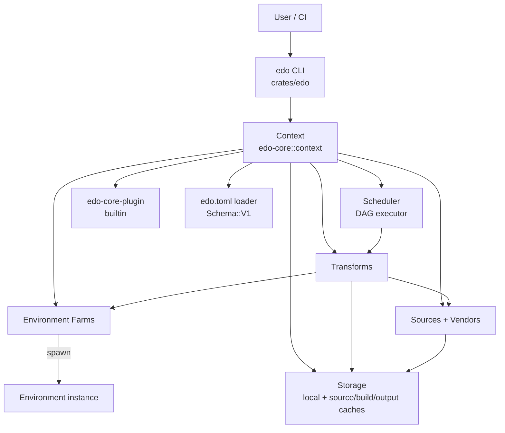

# Edo Build Tool - High-Level Design

## 1. Executive Summary

Edo is a next-generation build tool implemented in Rust that addresses critical
limitations in existing build systems like Bazel, Buck2, and BuildStream. The
primary innovation of Edo is its flexible approach to build environments while
maintaining reproducibility. This document outlines the detailed architectural
design of Edo, expanding on the four core abstractions that shape every build:
**Storage**, **Source**, **Environment**, and **Transform**.

Designed for software developers building applications for platforms like
Flatpak and Snap, as well as OS builders like Bottlerocket, Edo provides
precise control over where and how builds execute while supporting extensibility
through its modular architecture. This architecture enables the
creation of portable binaries with specific compatibility requirements — for
example, targeting a particular GLIBC version — which has been a pain point in
existing build tools.

## 2. Strategic Context

### 2.1 Current Limitations

Existing build tools present several limitations that impede efficient software
development:

- **Rigid Environment Control**: Tools like Bazel and Buck2 don't provide
  sufficient flexibility in defining where builds happen and the environments
  around them.
- **Opinionated Artifact Management**: Current tools are too prescriptive about
  how external artifacts are imported into the build system.
- **Environment/Execution Coupling**: BuildStream, while better at environment
  control, tightly couples this with specific execution technologies like
  chroots and bubblewrap namespaces.
- **Binary Compatibility Challenges**: Creating binaries with specific GLIBC
  version compatibility requires complex workarounds in current systems.

### 2.2 Strategic Differentiators

Edo addresses these limitations through:

1. **Separation of Concerns**: Clear boundaries between build definition,
   environment specification, and execution mechanisms.
2. **Extensibility First**: Modular architecture for customizing any of the
   four core abstractions.
3. **Environment Flexibility**: Support for multiple execution environments
   (local, container) without being tied to a specific isolation technology.
4. **Artifact-centric Design**: OCI-style artifact model (Blake3-hashed layers
   with media types) that enables consistent handling across local and remote
   storage backends.

## 3. Technical Architecture

### 3.1 System Architecture Overview

Edo is organized around four pluggable abstractions — **Storage**, **Source**,
**Environment**, **Transform** — coordinated by a `Context` (the shared build
session) and executed by a `Scheduler` (the DAG worker pool). The builtin
implementations are provided by `edo-core-plugin`.



There is no single "build engine" struct. The responsibilities traditionally
assigned to one are split cleanly:

- `Context` (`crates/edo-core/src/context/mod.rs`) owns configuration, the
  storage composite, the farm / source / transform / vendor registries, the
  `LogManager`, and the lock file.
- `Scheduler` (`crates/edo-core/src/scheduler/mod.rs`) owns DAG construction
  and parallel execution with a configurable worker pool.

### 3.2 Core Abstractions

All four core abstractions are declared with the `arc_handle` macro. Callers
implement a `*Impl` trait, wrap it with `Trait::new(impl)`, and receive a
`Clone + Send + Sync` handle. The same handle type is used for any
implementation.

#### 3.2.1 Context & Scheduler

`Context` is the central coordinator for a build session. It holds:

- Project path and working directory (`.edo/` by default).
- `Config` parsed from `edo.toml` via `Schema::V1`.
- The composite `Storage` (local backend plus named source caches and optional
  build / output caches).
- The `Scheduler` and `LogManager`.
- Registries for plugins, farms, sources, transforms, and vendors — each keyed
  by a hierarchical `Addr`.
- A `Lock` loaded from / written to `edo.lock.json`.

`Context::init` bootstraps the session. The CLI's `create_context` helper then
registers the builtin `edo-core-plugin` and a default `//default` local farm
before calling `Context::load_project(locked)`.

`Scheduler::run(ctx, addr)` builds a dependency `Graph` rooted at the requested
transform, pre-fetches its sources through `Storage`, then executes the DAG
with `N` worker tasks (default `8`, overridable via `[config] scheduler.workers`
in `edo.toml`).

#### 3.2.2 Storage

Storage is a composite facade over one or more `Backend` implementations:

- `//edo-local-cache` — the mandatory local backend under `.edo/`.
- `//edo-source-cache/<name>` — optional remote caches for source artifacts.
- `//edo-build-cache` — optional remote cache for build outputs.
- `//edo-output-cache` — optional remote cache for final outputs.

The only builtin non-local backend is `s3`.

**Architectural elements**:

- **Artifact model**: OCI-style `Artifact` with a manifest plus one or more
  `Layer`s. Layers carry a `MediaType` (e.g. `Tar(Compression)`) and are
  content-addressed by Blake3 (`Id`).
- **Cache coherency**: `Storage::fetch_source` pulls from any configured remote
  cache into the local backend before use. `Source::cache(log, storage)` is the
  standard front door — it checks storage before falling back to a fresh
  `fetch`.
- **Extraction**: `edo checkout` streams matching tar layers through the
  appropriate decoder (`bzip2`, `lzma`, `xz`, `gzip`, `zstd`, or raw) into the
  requested output directory.

#### 3.2.3 Source & Vendor

`Source` handles the acquisition of external code and artifacts. `Vendor`
resolves a `(name, version)` pair into a concrete `Node` that can be added to
the DAG as a regular source.

**Builtin source kinds** (from `edo-core-plugin`):

- `local` — files from the project tree (optionally archived).
- `git` — clone and checkout.
- `remote` — fetch a URL.
- `image` — pull an OCI image layer.
- `vendor` — resolve through a registered `Vendor`.

**Builtin vendor kinds**:

- `image` — OCI registries (e.g. `public.ecr.aws/...`).

**Lock file**: version constraints declared in `[requires.*]` are solved with
`resolvo` and the resolved `(Addr → Node)` map plus a manifest digest are
written to `edo.lock.json`. `edo update` refreshes the lock; subsequent
commands run locked, skipping re-resolution when the manifest digest matches.

#### 3.2.4 Environment & Farm

An `Environment` is an isolated execution context with a `setup → up →
(write/unpack/cmd/run/read)* → down → clean` lifecycle. A `Farm` is a factory
that produces `Environment` instances for a given working directory.

**Builtin farm kinds**:

- `local` — runs commands directly on the host.
- `container` — runs commands inside Docker, Podman, or Finch (auto-detected
  via `which`).

The CLI always registers a default `//default` local farm, so transforms that
don't explicitly specify `environment = "//..."` fall through to the host.

`Environment::defer_cmd(log, id)` produces a `Command` builder — a scriptable,
deferred sequence of operations (`chdir`, `pushd/popd`, `create-dir`, `copy`,
`run`, `send`, …) used heavily by transforms.

#### 3.2.5 Transform

A `Transform` produces an output `Artifact` from its inputs. Its key methods
are:

- `environment() -> Addr` — which farm to run in.
- `depends() -> Vec<Addr>` — DAG edges.
- `get_unique_id(handle) -> Id` — cache key (content-addressed).
- `prepare`, `stage`, `transform` — the per-run hooks.
- `can_shell` / `shell(env)` — optional interactive debugging drop-in.

`transform` returns a `TransformStatus` variant:

- `Success(Artifact)` — saved to storage by the scheduler.
- `Retryable(Option<PathBuf>, Error)` — scheduler may re-queue.
- `Failed(Option<PathBuf>, Error)` — terminal failure.

**Builtin transform kinds**:

- `import` — import source artifacts into a new artifact.
- `compose` — compose artifacts from other transforms.
- `script` — run Handlebars-templated shell commands (`{{install-root}}`,
  `{{build-root}}`, and `--arg` values).

### 3.3 Build Configuration

Edo is configured through `edo.toml` files. The top-level key `schema-version`
dispatches to a schema loader; currently only `"1"` (`Schema::V1`) is
implemented (see `crates/edo-core/src/context/schema.rs`).

Every TOML table under `[source.*]`, `[transform.*]`, `[environment.*]`,
`[vendor.*]`, `[requires.*]`, and `[cache.*]` becomes a `Node` registered
under a hierarchical `Addr` such as `//<project>/<name>`.

Example — `examples/hello_rust/edo.toml`:

```toml
schema-version = "1"

[source.src]
kind       = "local"
path       = "hello_rust"
out        = "."
is_archive = false

[transform.code]
kind   = "import"
source = ["//hello_rust/src"]

[transform.vendor]
kind     = "script"
depends  = ["//hello_rust/code"]
commands = [
    "mkdir -p {{install-root}}/.cargo",
    "cargo vendor > vendor.toml",
    "cp -rf {{build-root}}/vendor {{install-root}}/vendor",
    "cp vendor.toml {{install-root}}/.cargo/config.toml"
]

[transform.build]
kind     = "script"
depends  = ["//hello_rust/code", "//hello_rust/vendor"]
commands = [
    "mkdir -p {{install-root}}/bin",
    "cargo build --offline --release",
    "cp target/release/hello_rust {{install-root}}/bin/hello_rust"
]
```

Example — `examples/hello_oci/edo.toml` (demonstrates `[vendor]`,
`[requires]`, and a container environment):

```toml
schema-version = "1"

[vendor.public-ecr]
kind = "image"
uri  = "public.ecr.aws/docker/library"

[requires.gcc]
kind = "image"
at   = "=14.3.0"

[environment.gcc]
kind   = "container"
source = ["//hello_oci/gcc"]

[source.code]
kind       = "local"
path       = "hello_oci"
out        = "."
is_archive = false

[transform.build]
kind        = "script"
environment = "//hello_oci/gcc"
source      = ["//hello_oci/code"]
commands    = [
    "mkdir -p {{install-root}}/bin",
    "gcc -o hello_oci hello.c",
    "cp hello_oci {{install-root}}/bin/hello_oci"
]
```

Templating in `ScriptTransform.commands` is performed with Handlebars; the
standard variables are `{{install-root}}`, `{{build-root}}`, and any values
passed on the CLI via `--arg KEY=VALUE`.

### 3.4 CLI Surface

Binary: `edo`. Defined in `crates/edo/src/main.rs`.

```
edo [GLOBAL FLAGS] <SUBCOMMAND> [ARGS...]

Global flags:
  -d, --debug              Enable debug logging
  -t, --trace              Enable trace logging
  -c, --config <PATH>      Override edo.toml location
  -s, --storage <PATH>     Override storage / working dir (default: .edo/)

Subcommands:
  run      <ADDR> [--arg K=V]...                Build a transform
  checkout <ADDR> <OUT> [--arg K=V]...          Extract a built artifact's layers
  prune                                         Prune cached artifacts
  update                                        Refresh edo.lock.json
  list                                          List transforms / addresses
```

### 3.5 Addressing

Everything registered in a `Context` is keyed by an `Addr` parsed via
`Addr::parse`:

- `//<project>/<name>` — user items declared in `edo.toml`.
- `//default` — the default local farm auto-registered by the CLI.
- `//edo-local-cache`, `//edo-source-cache/<name>`, `//edo-build-cache`,
  `//edo-output-cache` — reserved storage slots.

## 4. Implementation Strategy

### 4.1 Core Implementation

The core of Edo is implemented in Rust (edition 2024, MSRV 1.86). The
implementation follows these principles:

1. **Handle-based ownership** — every trait is exposed through an
   `arc_handle`-generated newtype over `Arc<dyn Trait>`, so passing
   abstractions around is cheap.
2. **Typed errors** — every subsystem defines a `snafu` error enum. The CLI's
   `main` uses `#[snafu::report]` for formatted diagnostics, and subsystems
   bubble errors with `#[snafu(transparent)]` variants.
3. **Tracing everywhere** — `tracing` macros are re-exported via
   `#[macro_use] extern crate tracing;` in library crates; per-task `Log`
   handles write to files under `.edo/`.
4. **Testing and linting** — `cargo-deny` enforces license / advisory / ban
   policy via `deny.toml` at the repository root.

### 4.2 Build Phases

A typical `edo run <addr>` proceeds through:

1. **Configuration loading** — parse `edo.toml` (`Schema::V1`), construct
   `Config` / `Storage` / `Scheduler`.
2. **Plugin registration** — register the builtin `edo-core-plugin`.
3. **Project loading** — iterate `[source]`, `[transform]`, `[environment]`,
   `[vendor]`, `[requires]`; dispatch each `Node` to the builtin plugin.
4. **Dependency resolution** — if locked, trust `edo.lock.json`; otherwise
   invoke `resolvo` through registered vendors.
5. **Graph construction** — walk `Transform::depends` from the requested root.
6. **Source acquisition** — `Source::cache` for every leaf, synchronizing
   remote source caches into the local backend as needed.
7. **Scheduled execution** — worker tasks pick ready nodes, check cache via
   `get_unique_id`, otherwise run `prepare → stage → transform` in a freshly
   provisioned environment.
8. **Artifact storage** — `Success(artifact)` outputs are saved to local
   storage and optionally mirrored to build / output caches.

### 4.3 Development Approach

Development proceeds in phases:

1. **Foundation** — core traits, in-process core plugin, TOML schema v1.
2. **Builtin breadth** — additional source / environment / vendor kinds.
3. **Distributed caching** — filling out the build / output cache story.
4. **Remote execution & IDE/CI integrations** — see §6 Future Considerations.

## 5. Operational Considerations

### 5.1 Performance Optimization

- **Parallel execution** — the scheduler runs a configurable worker pool
  (default 8) over the DAG.
- **Incremental builds** — every transform's `get_unique_id` is
  content-addressed; cache hits skip execution entirely.
- **Efficient caching** — remote caches are consulted via `fetch_source`
  before local execution; layers are streamed, not fully buffered.
- **Environment reuse** — `Farm::setup` runs once per farm, while `create`
  provisions per-build working directories.

### 5.2 Security Model

- **Content addressing** — every artifact and source is identified by a
  Blake3-based `Id`. The storage layer validates computed digests against
  the expected `Id` on both save (write) and open (read) paths; mismatches
  are rejected before the artifact is exposed to a transform.
- **Lock file** — `edo.lock.json` pins vendored dependencies by version and
  hash.
- **Container isolation** — for `kind = "container"` environments, Edo defers
  to Docker / Podman / Finch for process and filesystem isolation.

### 5.3 Error Handling and Recovery

- Every subsystem exposes a typed `*Error` enum; they compose through
  `#[snafu(transparent)]`.
- `TransformStatus::Retryable` allows the scheduler to re-queue flaky
  transforms without failing the run.
- `Transform::can_shell` / `shell(env)` enables interactive debugging drop-in
  on failures (driven by `dialoguer`).
- `main` reports failures with `#[snafu::report]`.

### 5.4 Scaling Strategy

- **Distributed caching** — `s3` backends already participate as source /
  build / output caches.
- **Selective building** — `edo run <addr>` only builds the transitive
  closure of the requested target; `edo checkout` extracts without rebuild
  when the artifact is already cached.
- **Remote execution** — not yet implemented; see §6.

## 6. Alternatives Analysis

### 6.1 Build Environment Approach

**Options considered**:

1. Fixed environment types with no extensibility.
2. A dedicated environment DSL.
3. A modular approach with a small set of builtins.

**Decision**: Modular approach. Ships with `local` and `container` builtin
farms, with room for future extension.

### 6.2 Artifact Storage

**Options considered**:

1. A proprietary artifact format.
2. Standard archive formats (tar, zip) at the top level.
3. An OCI-style layered artifact model.

**Decision**: OCI-style layers with media types and Blake3 content addressing.
This preserves ecosystem compatibility (tar layers can be unpacked by
`edo checkout`) while supporting custom media types for non-tar payloads.

### 6.3 Configuration Format

**Options considered**:

1. A custom DSL.
2. A scripted configuration language (e.g. Starlark).
3. A declarative format (TOML / YAML / JSON).

**Decision**: TOML, surfaced through a versioned schema (`schema-version =
"1"`). This keeps project manifests declarative and easy to lint, while the
underlying `Node` model is flexible enough to support future extensions.
Anything that would benefit from scripted configuration is instead expressed
as a transform (e.g. Handlebars-templated `script` commands).

## 7. Success Metrics

The success of Edo is measured by:

1. **Build performance** — wall-clock improvements over existing tools on
   representative workloads.
2. **Flexibility** — ability to target diverse environments (host, container)
   from a single manifest.
3. **Reproducibility** — identical `Id`s across machines for identical inputs.
4. **Adoption** — use by target audiences (Flatpak / Snap application
   developers, OS builders such as Bottlerocket).

## 8. Future Considerations

Not yet implemented; under consideration:

1. **Remote build federation** — distributing transform execution across
   multiple workers.
2. **Deeper CI/CD integration** — first-class hooks for common pipelines.
3. **Build visualization** — graph explorers for dependency inspection.
4. **Advanced caching strategies** — speculative prefetch, partial layer
   reuse, cross-project dedup.
5. **IDE integration** — LSP-style integration with common editors.
6. **Stricter environment sandboxing** — today Edo delegates process,
   filesystem, and network isolation for `kind = "container"` farms to the
   underlying container runtime (Docker / Podman / Finch). First-class
   edo-enforced policies (network isolation toggles, filesystem allow-lists,
   resource limits) are planned but not yet implemented at the edo layer.
